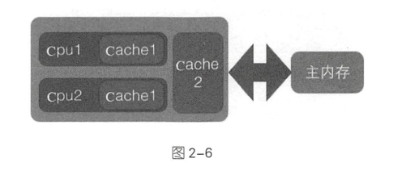

- [第2章-并发编程的其他基础知识](#sec-1)
  - [什么是多线程并发编程](#sec-1-1)
  - [Java中的线程安全问题](#sec-1-2)
  - [Java中共享变量的内存可见性问题](#sec-1-3)
  - [Java中的synchronized关键字](#sec-1-4)
    - [synchronized关键字介绍](#sec-1-4-1)
    - [synchronized的内存语义](#sec-1-4-2)
    - [Java中的volatile关键字](#sec-1-4-3)
  - [Java中的原子性操作](#sec-1-5)
  - [Java中的CAS操作](#sec-1-6)
  - [Unsafe类](#sec-1-7)
    - [Unsafe类中的重要方法](#sec-1-7-1)
    - [如何使用Unsafe类](#sec-1-7-2)
  - [Java指令重排序](#sec-1-8)
  - [伪共享](#sec-1-9)
    - [为何会出现伪共享](#sec-1-9-1)
    - [如何避免伪共享](#sec-1-9-2)
  - [锁的概述](#sec-1-10)
    - [乐观锁与悲观锁](#sec-1-10-1)
    - [公平锁与非公平锁](#sec-1-10-2)
    - [独占锁与共享锁](#sec-1-10-3)
    - [可重入锁](#sec-1-10-4)
    - [自旋锁](#sec-1-10-5)

# 第2章-并发编程的其他基础知识<a id="sec-1"></a>

## 什么是多线程并发编程<a id="sec-1-1"></a>

并发：指同一时间段多个任务同时都在执行，并且都没有执行结束。 并行：在单位时间内多个任务同时在执行。

并发任务强调多个任务在一个时间段内同时执行，而一个时间段是由多个时间单位累积而成的，所以并发的多个任务在单位时间内不一定同时在执行。

多线程编程实践中，线程的个数往往多于CPU的个数，所以一般都称多线程并发编程而不是多线程并行编程。

## Java中的线程安全问题<a id="sec-1-2"></a>

共享资源就是说该资源被多个线程所持有或者多个线程都可以去访问该资源。

线程安全问题是指当多个线程同时读写一个共享资源并且没有任何同步措施时，导致出现脏数据或其他不可预见的结果的问题。

## Java中共享变量的内存可见性问题<a id="sec-1-3"></a>

Java内存模型规定，将所有变量都存放在主内存中，当线程使用变量时，会把主内存里面的变量复制到自己的工作空间或者叫工作内存，线程读写变量时操作的是自己工作内存的变量。

## Java中的synchronized关键字<a id="sec-1-4"></a>

### synchronized关键字介绍<a id="sec-1-4-1"></a>

`synchronized` 块是Java提供的一种原子性内置锁，也叫做监视器锁。

线程执行代码在进入 `synchronized` 代码块前会自动获取内部锁，这时候其他线程访问该同步代码块时会被阻塞挂起。

拿到内部锁的线程会在正常退出同步代码块或者抛出异常后或者在同步代码块内调用了该内置锁资源的 `wait` 系列方法时才释放该内置锁。

内置锁是排它锁，也就是说当一个线程获取到这个锁后，其他线程必须等待该线程释放锁后才能获取该锁。

Java中的线程与操作系统的原生线程一一对应，所以阻塞一个线程时，需要从用户态切换到内核态执行阻塞操作，这个操作比较耗时， `synchronized` 使用就会导致上下文切换。

### synchronized的内存语义<a id="sec-1-4-2"></a>

进入 `synchronized` 块(加锁)的内存语义就是把在 `synchronized` 块内使用到的变量从线程的工作内存中清除， `synchronized` 块内使用到的变量直接从主存中获取。

退出 `synchronized` 块(解锁)的内存语义就是把在 `synchronized` 块对共享变量的修改刷新到主内存。

`synchronized` 关键字会引起线程上下文切换并带来线程调度开销。

### Java中的volatile关键字<a id="sec-1-4-3"></a>

`volatile` 关键字可以确保对一个变量的更新对其他线程马上可见(弱形式的同步)。

当一个变量被声明为 `volatile` 时，线程在写入变量时不会把值缓存在寄存器或者其他地方，而是会把值刷新回主内存。当其他线程读取该变量时，会从主内存重新获取最新值，而不是使用当前线程的工作内存中的值。

`volatile` 保证了内存可见性，但不保证操作的原子性。

使用 `volatile` 的场景

-   写入变量不依赖变量的当前值。
-   读写变量时没有加锁。

## Java中的原子性操作<a id="sec-1-5"></a>

线程不安全计算器类

```java
package chapter2;

/**
 * @program: BeautiOfConcurrency
 * @author: devinkin
 * @create: 2019-08-01 16:26
 * @description: 线程不安全计算器类
 **/
public class ThreadNotSafeCount {
    private Long value;

    public Long getValue() {
        return value;
    }

    public void inc() {
        ++value;
    }
}
```

线程安全计算器类

```java
package chapter2;

/**
 * @program: BeautiOfConcurrency
 * @author: devinkin
 * @create: 2019-08-01 16:28
 * @description: 线程安全计算器
 **/
public class ThreadSafeCount {
    private Long value;

    public synchronized Long getCount() {
        return value;
    }

    public synchronized void inc() {
        ++value;
    }
}
```

## Java中的CAS操作<a id="sec-1-6"></a>

CAS(Compare and Swap)是JDK提供的非阻塞原子操作，它通过硬件保证了比较-更新操作的原子性。

`boolean compareAndSwapLong(Object obj, long valueOffset, long expect, long update)` 方法：

-   obj，对象内存位置
-   valueOffset，对象中的变量的偏移量
-   expect，变量预期值
-   udpate，变量新的值

JDK中的 `AtomicStampedReference` 类给每个变量的状态值都配备了一个时间戳，从而避免了ABA的问题(变量环形转换)。

## Unsafe类<a id="sec-1-7"></a>

### Unsafe类中的重要方法<a id="sec-1-7-1"></a>

JDK的rt.jar包中的 `Unsafe` 类提供了硬件级别的原子性操作。

`long objectFieldOffset(Field field)` 方法：返回指定的变量在所属类中的内存偏移地址，该偏移地址仅仅在该 `Unsafe` 函数中访问指定字段时使用。

```java
static {
    try {
        valueOffset = unsafe.objectFieldOffset(AtomicLong.class.getDeclaredField("value"));
    } catch (Exception ex) {
        throw new Error(ex);
    }
}
```

`int arrayBaseOffset(Class arrayClass)` 方法：获取数组中第一个元素的地址。

`int arrayIndexScale(Class arrayClass)` 方法：获取数组中第一个元素占用的字节。

`boolean compareAndSwapLong(Object obj, long offset, long expect, long update)` 方法：比较对象obj中偏移量为 `offset` 的变量的值是否与 `expect` 想等，相等则使用 `update` 值更新，然后返回 `true` ，否则返回 `false` 。

`public native long getLongvolatile(Object obj, long offset)` 方法：获取对象 `obj` 中偏移量为 `offset` 的变量对应的 `volatile` 语义的值。

`void putLongvolatile(Object obj, long offset, long value)` 方法：设置 `obj` 对象中的 `offset` 偏移的类型为 `long` 的 `field` 的值为 `value` ，支持 `volatile` 语义。

`void putOrderedLong(Object obj, long offset long value)` 方法：设置 `obj` 对象中的 `offset` 偏移的类型为 `long` 的 `field` 的值为 `value` ，并不保证值修改对其他线程立刻可见。只有在变量使用 `volatile` 修饰并且预计会被以外修改时才会使用该方法。

`void park(boolean isAbsolute, long time)` 方法：阻塞当前线程，其中参数 `isAbsolute` 为 `false` 且 `time` 等于0表示一直阻塞。 `time` 大于0表示等待指定的 `time` 后阻塞线程会被唤醒，是相对当前时间累加 `time` 后当前线程就会被唤醒。

`void unpark(Object thread)` 方法：唤醒 `park` 后阻塞的线程。

`long getAndSetLong(Object obj, long offset, long update)` 方法：获取对象 `obj` 中偏移量为 `offset` 的变量 `volatile` 语义的当前值，并设置变量 `volatile` 语义的值为 `update` 。

```java
public final long getAndSetLong(Object obj, long offset, long update) {
    long l;
    do {
        l = getLongvolatile(obj, offset);
    } while (!compareAndSwapLong(obj, offset, l, update));
    return l;
}
```

`long getAndAddLong(Object obj, long offset, long addValue)` 方法：获取对象 `obj` 中偏移量为 `offset` 的变量 `volatile` 语义的当前值，并设置变量值为原始值 + `addValue` 。

```java
public final long getAndAddLong(Object obj, long offset, long addValue) {
    long l;
    do {
        l = getLongvolatile(obj, offset);
    } while (!compareAndSwapLong(obj, offset, 1, 1 + addValue));
    return l;
}
```

### 如何使用Unsafe类<a id="sec-1-7-2"></a>

```java
package chapter2;


import sun.misc.Unsafe;

import java.lang.reflect.Field;

/**
 * @program: BeautiOfConcurrency
 * @author: devinkin
 * @create: 2019-08-01 17:09
 * @description: Unsafe测试类
 **/
public class TestUnsafe {
    // 获取Unsafe实例
    static final Unsafe unsafe;

    // 记录变量state在类TestUnsafe中的偏移值
    static final long stateOffset;

    // 变量
    private volatile long state=0;

    static {
        try {
            // 使用反射获取Unsafe的成员变量theUnsafe
            Field field = Unsafe.class.getDeclaredField("theUnsafe");

            // 设置为可存取
            field.setAccessible(true);
            // 获取该变量的值
            unsafe = (Unsafe) field.get(null);

            // 获取state变量在TestUnsafe中的偏移值
            stateOffset = unsafe.objectFieldOffset(TestUnsafe.class.getDeclaredField("state"));
        } catch (Exception ex) {
            System.out.println(ex.getLocalizedMessage());
            throw new Error(ex);
        }
    }

    public static void main(String[] args) {
        // 创建实例
        TestUnsafe test = new TestUnsafe();

        System.out.println(test.state);
        Boolean success = unsafe.compareAndSwapInt(test, stateOffset, 0, 1);
        System.out.println(test.state);
        System.out.println(success);
    }
}
```

## Java指令重排序<a id="sec-1-8"></a>

Java内存模型允许编译器和处理器对指令重排以提高运行性能，并且只会对不存在数据依赖性的指令重排序。

使用 `volatile` 修饰 `ready` 可以避免重排序和内存可见性问题。

## 伪共享<a id="sec-1-9"></a>

CPU与内存主存间有一级或多级高级缓冲存储器。这个Cache内部是按行存储的，每一行称为一个Cache行。 

Cache行是与Cache与主存进行数据交换的单位，一般为2的幂次数字节。 

CPU访问某个变量时，首先看CPU Cache内是否有该变量，如果有则直接从中获取，否则就去主内存里面获取该变量，然后把该变量所在内存区域的一个Cache行大小的内存复制到Cache中。

伪共享是由于存放到Cache行的是内存块而不是单个变量，所以可能会把多个变量存放到一个Cache行中。当多个线程同时修改一个缓存行里面的多个变量时，由于同时只能由一个线程操作缓存行，相比将每个变量放到缓存行，性能会有所下降。

### 为何会出现伪共享<a id="sec-1-9-1"></a>

伪共享的产生是因为多个变量被放入一个缓存行中，并且多个线程同时去写入缓存中不同的变量。

单线程访问将数组元素放入一个或多个缓存行对代码执行是有利的，因为数据都在缓存行中，代码执行会更快。

按顺序访问数组的元素，一次内存访问可以让后偶棉多次访问直接在缓存中命中。(10ms以内)

```java
package chapter2.cache;

/**
 * @program: BeautiOfConcurrency
 * @author: devinkin
 * @create: 2019-08-02 10:20
 * @description: 单线程缓存行测试
 **/
public class TestForContent {
    static final int LINE_NUM = 1024;
    static final int COLUMN_NUM = 1024;

    public static void main(String[] args) {
        long [][] array = new long[LINE_NUM][COLUMN_NUM];

        long startTime = System.currentTimeMillis();
        for (int i = 0; i < LINE_NUM; i++) {
            for (int j = 0; j < COLUMN_NUM; j++) {
                array[i][j] = i*2 + j;
            }
        }
        long endTime = System.currentTimeMillis();
        long cacheTime = endTime - startTime;
        System.out.println("cache time: " + cacheTime);
    }
}
```

不按顺序访问数组的元素，内存置换过来的缓存行的元素还没等到读取就被替换掉了。(10ms以上)

```java
package chapter2.cache;

/**
 * @program: BeautiOfConcurrency
 * @author: devinkin
 * @create: 2019-08-02 10:30
 * @description: 缓存测试类2
 **/
public class TestForContent2 {
    static final int LINE_NUM = 1024;
    static final int COLUMN_NUM = 1024;

    public static void main(String[] args) {
        long [][] array = new long[LINE_NUM][COLUMN_NUM];

        long startTime = System.currentTimeMillis();
        for (int i = 0; i < COLUMN_NUM; i++) {
            for (int j = 0; j < LINE_NUM; j++) {
                array[j][i] = i*2 + j;
            }
        }
        long endTime = System.currentTimeMillis();
        System.out.println("no cache time: " + (endTime - startTime));
    }

```

### 如何避免伪共享<a id="sec-1-9-2"></a>

JDK8之前一般通过字节填充的方式避免，创建一个变量时用填充字段填充该变量所在的缓存行，避免了将多个变量存放在同一个缓存行中。

假如缓存行为64字节，FilledLong类填充了6哥long类型的变量，每个long类型变量占8个字节，加上value变量8个字节共56字节。FilledLong是个类对象，而类对象的字节码的对象头占8个字节。总和为64字节。

```java
public final static class FilledLong {
    public volatile long value = 0L;
    public long p1, p2, p3, p4, p5, p6;
}
```

JDK8提供了 `sun.misc.Contented` 注解来解决伪共享问题。

```java
@sun.misc.Contented
public final static class FilledLong {
    public volatile long value = 0L;
}

```

`sun.misc.Contented` 可以修饰类也可以修饰变量

默认情况下， `@Contented` 注解只用于Java核心类，比如 `rt` 包下的类。如果用户类路径下的类使用这个注解，需要添加 `JVM` 参数。 `-XX:-RestrictContented` ，填充的宽度默认为128，要自定义宽度可以设置 `-XX:ContentedPaddingWidth` 参数。

## 锁的概述<a id="sec-1-10"></a>

### 乐观锁与悲观锁<a id="sec-1-10-1"></a>

悲观锁是指对数据被外部修改持保守态度，认为数据很容易就会被其他线程修改，所以数据被处理前先对数据进行加锁，并在整个数据处理过程中，使数据处于锁定状态。

悲观锁的实现往往依靠数据库提供的锁机制，即在数据库中，在对数据记录操作前给记录加排它锁。

```java
public int updateEntry(long id) {
    // 使用悲观锁取指定记录
    EntryObject entry = query("SELECT * FROM table1 WHERE id=#{id} FOR UPDATE", id);

    // 修改记录内容，根据计算修改entry记录的属性
    String name = generatorName(entry);
    entry.setName(name);

    // update操作
    int count = update("UPDATE table1 SET name=#{name},arg=#{arg} WHERE id=#{id}", entry);

    return count;
}
```

乐观锁是相对悲观锁来说的，它认为数据在一般情况下不会造成冲突，所以在访问记录前不会加排它锁，而是在数据提交更新时，才会正式对数据冲突与否进行检测。

```java
public int updateEntry(long id) {
    boolean result = false;
    int retryNum = 5;
    while (retryNum > 0) {
        // 使用乐观锁获取指定记录
        EntryObject entry = query("SELECT * FROM table1 WHERE id=#{id}", id);

        // 修改记录内容，version字段不能被修改
        String name = generatorName(entry);
        entry.setName(name);

        // update操作
        int count = update("UPDATE table1 SET name=#{name},age=#{age},version=${version}+1 WHERE id=#{id} AND version=#{version}", entry);

        if (count == 1) {
            result = true;
            break;
        }
        retryNum--;
    }
    return result;
}
```

乐观锁并不会使用数据库提供的锁机制，一般在表中添加 `version` 字段或者使用业务状态来实现。乐观锁直到提交时才锁定，所以不会产生任何死锁。

### 公平锁与非公平锁<a id="sec-1-10-2"></a>

根据线程获取锁的抢占机制，锁可以分为公平锁和非公平锁。

公平锁表示顺序是按照线程请求锁的时间早晚来决定的，也就是最早请求锁的线程最早获得锁。

非公平锁则在运行时闯入，也就是先来的不一定先得。

`ReentrantLock` 提供了公平和非公平锁的实现

-   公平锁： `ReentrantLock pairLock = new ReentrantLock(true)` 。
-   非公平锁： `ReentrantLock pairLock = new ReentrantLock(false)` 。构造函数不传递参数，则默认是非公平锁。

在没有公平性需求的前提下尽量使用非公平锁，因为公平锁会带来性能开销。

### 独占锁与共享锁<a id="sec-1-10-3"></a>

根据锁只能被单个线程持有还是能被多个线程共同持有，锁可以分为独占锁和共享锁。

独占锁保证任何时候都只有一个线程能得到锁。 `ReentrantLock` 就是以独占方式实现的。

共享锁可以同时由多个线程持有， `ReadWriteLock` 读写锁，它允许一个资源可以被多个线程同时进行读操作。

独占锁是一种悲观锁，共享锁是一种乐观锁。

### 可重入锁<a id="sec-1-10-4"></a>

可重入锁：指当一个线程要获取一个被其他线程持有的独占锁时，该线程会被阻塞，当线程自己再次获取自己已经获取锁时不被阻塞。

`synchronized` 内部锁是可重入锁。调用方法 `helloB` ，当前线程不被阻塞。

```java
package chapter2.lock;

/**
 * @program: BeautiOfConcurrency
 * @author: devinkin
 * @create: 2019-08-02 11:23
 * @description: 可重入锁测试
 **/
public class Hello {
    public synchronized void helloA() {
        System.out.println("hello");
    }

    public synchronized void helloB() {
        System.out.println("hello B");
        helloA();
    }
}
```

可重入锁的原理是在锁内部维护一个线程标识，用来标识该锁目前被哪个线程占用，然后关联一个计数器。一开始计数器为0，说明该锁没有被任何线程占用。其他线程获取该锁会被阻塞挂起，本线程自己获取该锁，计数器值加1。

### 自旋锁<a id="sec-1-10-5"></a>

自旋锁是当前线程获取锁时，如果发现锁已经被其他线程占用，它不马上阻塞自己，在不放弃CPU使用权的情况下，多次尝试获取（默认次数是10，可以使用 `-XX:PreBlockSpinsh` ）参数设置该值。

自旋锁是使用CPU时间换取线程阻塞与调度的开销。
