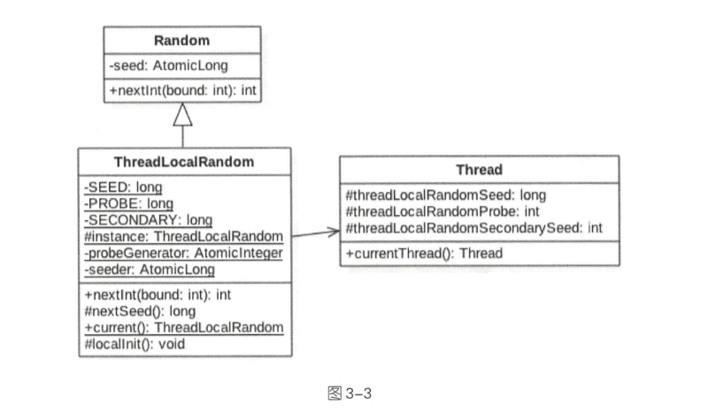

- [第3章-Java并发包中的ThreadLocalRandom类原理剖析](#sec-1)
  - [Random类及其局限性](#sec-1-1)
  - [ThreadLocalRandom](#sec-1-2)
  - [ThreadLocalRandom源码分析](#sec-1-3)
    - [Unsafe机制](#sec-1-3-1)
    - [ThreadLocalRandom current()方法](#sec-1-3-2)
    - [int nextInt(int bound)方法](#sec-1-3-3)

# 第3章-Java并发包中的ThreadLocalRandom类原理剖析<a id="sec-1"></a>

## Random类及其局限性<a id="sec-1-1"></a>

Random有默认的种子，生成随机数的方法如下

-   首先根据老的种子生成新的种子
-   然后根据新的种子来计算新的随机数

```java
public int nextInt(int bound) {
    // 参数检查
    if (bound <= 0)
        throw new IllegalArgumentException(BadBound);

    // 根据老的种子生成新的种子
    int r = next(31);

    // 根据新的种子计算随机数
    int m = bound - 1;
    if ((bound & m) == 0)  // i.e., bound is a power of 2
        r = (int)((bound * (long)r) >> 31);
    else {
        for (int u = r;
             u - (r = u % bound) + m < 0;
             u = next(31))
            ;
    }
    return r;
    }
```

生成随机数的 `next()` 代码

-   获取原子变量的种子的值
-   根据当前种子值计算新的种子
-   使用CAS操作，它使用新的种子取更新老的种子。CAS操作会保证只有一个线程可以更新老的种子为新的。

```java
protected int next(int bits) {
    long oldseed, nextseed;
    AtomicLong seed = this.seed;
    do {
        oldseed = seed.get();
        nextseed = (oldseed * multiplier + addend) & mask;
    } while (!seed.compareAndSet(oldseed, nextseed));
    return (int)(nextseed >>> (48 - bits));
}
```

总结：每个Random实例里面都有一个原子性的种子变量用来记录当前的种子值，当要生成新的随机数时需要根据当前种子计算新的种子并更新会原子变量。当多线程下使用单个Random实例生成随机数时，当多个线程同时计算随机数来计算新的种子时，多个线程会竞争同一个原子变量的更新操作。由于原子变量的更新是CAS操作，同时只有一个线程会成功，所以会造成大量线程进行自旋重试，这样会降低并发性能。

## ThreadLocalRandom<a id="sec-1-2"></a>

使用

```java
package chapter3.threadlocalrandom;

import java.util.concurrent.ThreadLocalRandom;

/**
 * @program: BeautiOfConcurrency
 * @author: devinkin
 * @create: 2019-08-02 15:45
 * @description:
 **/
public class RandomTest {
    public static void main(String[] args) {
        ThreadLocalRandom random = ThreadLocalRandom.current();

        for (int i= 0; i < 10; i++) {
            System.out.println(random.nextInt(5));
        }
    }
}
```

Random的缺点是多个线程会使用同一个原子性种子变量。

ThreadLocalRandom的每个线程都维护一个种子变量。

## ThreadLocalRandom源码分析<a id="sec-1-3"></a>



`ThreadLocalRandom` 类继承了 `Random` 类并重写了 `nextInt` 方法。

`ThreadLocalRandom` 类没有使用继承字 `Random` 类的原子性种子变量。

`ThreadLocalRandom` 中没有存放具体的种子，具体的种子存放再具体的调用线程的 `threadLocalRandomSeed` 变量里面。

当调用 `ThreadLocalRandom` 的 `nextInt` 方法时，实际上获取是当前线程的 `threadLocalRandomSeed` 变量作为当前种子来计算新的种子，然后更新新的种子到当前线程的 `threadLocalRandomSeed` 变量，而后再根据新种子并使用具体算法计算随机数。

`threadLocalRandomSeed` 在 `Thread` 类里面是一个普通的 `long` 变量，并不是原子变量。

`seeder` 和 `probeGenerator` 是两个原子性变量，在初始化调用线程的种子和探针变量时会使用到他们，每个线程只会使用一次。

`instance` 变量是 `ThreadLocalRandom` 的一个实例，该变量是 `static` 的。多线程通过 `ThreadLocalRandom.current` 方法获取的是该实例。

由于具体的种子是存放在线程里面的，所以在 `ThreadLocalRandom` 的实例里面只包含了与线程无关的通用算法，所以它是线程安全的。

### Unsafe机制<a id="sec-1-3-1"></a>

```java
private static final sun.misc.Unsafe UNSAFE;
private static final long SEED;
private static final long PROBE;
private static final long SECONDARY;
static {
    try {
        // 获取unsafe实例
        UNSAFE = sun.misc.Unsafe.getUnsafe();
        Class<?> tk = Thread.class;
        // 获取Thread类里面的threadLocalRandomSeed变量在Thread实例里面的偏移量
        SEED = UNSAFE.objectFieldOffset
            (tk.getDeclaredField("threadLocalRandomSeed"));
        // 获取Thread类里面的hreadLocalRandomProbe变量在Thread实例里面的偏移量
        PROBE = UNSAFE.objectFieldOffset
            (tk.getDeclaredField("threadLocalRandomProbe"));
        // 获取Thread类里面的threadLocalRandomSecondarySeed变量在Thread实例里面的偏移量
        SECONDARY = UNSAFE.objectFieldOffset
            (tk.getDeclaredField("threadLocalRandomSecondarySeed"));
    } catch (Exception e) {
        throw new Error(e);
    }
    }
```

### ThreadLocalRandom current()方法<a id="sec-1-3-2"></a>

```java
// 如果threadLocalRandomProbe的变量值为0，则说明当前线程是第一次调用ThreadLocalRandom的current方法。
public static ThreadLocalRandom current() {
    if (UNSAFE.getInt(Thread.currentThread(), PROBE) == 0)
        localInit();
    return instance;
}


static final void localInit() {
    // 根据probeGenerator计算当前线程中的threadLocalRandomProbe的初始化值
    int p = probeGenerator.addAndGet(PROBE_INCREMENT);
    int probe = (p == 0) ? 1 : p; // skip 0
    // 根据seeder计算当前线程的初始化种子
    long seed = mix64(seeder.getAndAdd(SEEDER_INCREMENT));
    Thread t = Thread.currentThread();
    // 将上述两个变量设置到当前线程
    UNSAFE.putLong(t, SEED, seed);
    UNSAFE.putInt(t, PROBE, probe);
}
```

### int nextInt(int bound)方法<a id="sec-1-3-3"></a>

```java
public int nextInt(int bound) {
    // 参数校验
    if (bound <= 0)
        throw new IllegalArgumentException(BadBound);
    // 根据当前线程中的种子计算新种子
    int r = mix32(nextSeed());
    int m = bound - 1;
    // 根据新种子和bound计算随机数
    if ((bound & m) == 0) // power of two
        r &= m;
    else { // reject over-represented candidates
        for (int u = r >>> 1;
             u + m - (r = u % bound) < 0;
             u = mix32(nextSeed()) >>> 1)
            ;
    }
    return r;
}

final long nextSeed() {
    Thread t; long r; // read and update per-thread seed
    // 把新种子放入当前线程的 threadLocalRandomSeed变量中
    UNSAFE.putLong(t = Thread.currentThread(), SEED,
                   // 获取当前线程中threadLocalRandomSeed变量的值，然后累加GAMMA值作为新种子
                   r = UNSAFE.getLong(t, SEED) + GAMMA);
    return r;
}
```
