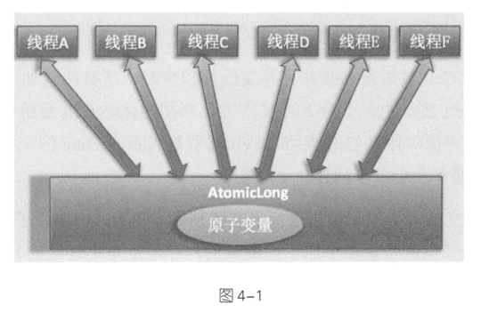
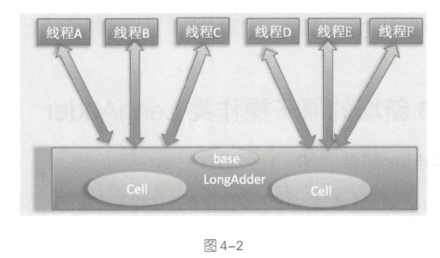

- [第4章-Java并法包中原子操作类原理剖析](#sec-1)
  - [原子变量操作类](#sec-1-1)
  - [JDK8新增的原子操作类LongAdder](#sec-1-2)
    - [LongAdder简单介绍](#sec-1-2-1)
    - [LongAdder代码分析](#sec-1-2-2)
    - [小结](#sec-1-2-3)
  - [LongAccumulator类原理探究](#sec-1-3)

# 第4章-Java并法包中原子操作类原理剖析<a id="sec-1"></a>

## 原子变量操作类<a id="sec-1-1"></a>

`AtomicLong` 类在 `rt.jar` 包下面， `AtomicLong` 类是通过 `BootStrap` 类加载器进行加载的。

```java
public class AtomicLong extends Number implements java.io.Serializable {
    private static final long serialVersionUID = 1927816293512124184L;

    // 获取Unsafe实例
    private static final Unsafe unsafe = Unsafe.getUnsafe();
    // 存放变量value的偏移量
    private static final long valueOffset;

    // 判断JVM是否支持Long类型无锁CAS
    static final boolean VM_SUPPORTS_LONG_CAS = VMSupportsCS8();

    private static native boolean VMSupportsCS8();

    static {
        try {
            // 获取value在AtomicLong中的偏移量
            valueOffset = unsafe.objectFieldOffset
                (AtomicLong.class.getDeclaredField("value"));
        } catch (Exception ex) { throw new Error(ex); }
    }

    // 实际的变量值
    private volatile long value;

    public AtomicLong(long initialValue) {
        value = initialValue;
    }
}
```

`AtomicLong` 递增和递减操作代码(JDK8)。 `getAndAddLong` 方法是个原子性操作，第一个参数是 `AtomicLong` 实例的引用，第二个参数是 `value` 变量在 `AtomicLong` 中的偏移值，第三个参数是要设置第二个变量在原有变量的基础上更新的值。

```java
// 调用unsafe方法，原子性设置为value值为原始值+1，返回值为递增后的值
public final long incrementAndGet() {
    return unsafe.getAndAddLong(this, valueOffset, 1L) + 1L;
}

// 调用unsafe方法，原子性设置为value值为原始值-1，返回值为递减后的值
public final long decrementAndGet() {
    return unsafe.getAndAddLong(this, valueOffset, -1L) - 1L;
}

// 调用unsafe方法，原子性设置为value值为原始值+1，返回值为原始值
public final long getAndIncrement() {
    return unsafe.getAndAddLong(this, valueOffset, 1L);
}

// 调用unsafe方法，原子性设置为value值为原始值-1，返回值为原始值
public final long getAndDecrement() {
    return unsafe.getAndAddLong(this, valueOffset, -1L);
}
```

`AtomicLong` 的使用，统计两个数组中0的个数

```java
package chapter4.atomiclong;

import java.util.concurrent.atomic.AtomicLong;

/**
 * @program: BeautiOfConcurrency
 * @author: devinkin
 * @create: 2019-08-05 12:34
 * @description: AtomicLong测试类
 **/
public class Atomic {
    // 创建Long型原子计数器
    private static AtomicLong atomicLong = new AtomicLong();

    // 创建数据源
    private static Integer[] arrayOne = new Integer[] {0,1,2,3,0,5,6,0,56,0};
    private static Integer[] arrayTwo = new Integer[] {10,1,2,3,0,5,6,0,56,0};

    public static void main(String[] args) throws InterruptedException {
        // 线程one统计数组arrayOne中0的个数
        Thread threadOne = new Thread(new Runnable() {
            @Override
            public void run() {
                int size = arrayOne.length;
                for (int i = 0; i < size; i++) {
                    if (arrayOne[i].intValue() == 0) {
                        atomicLong.incrementAndGet();
                    }
                }
            }
        });

        // 线程two统计数组arrayTwo中0的个数
        Thread threadTwo = new Thread(new Runnable() {
            @Override
            public void run() {
                int size = arrayTwo.length;
                for (int i = 0; i < size; i++) {
                    if (arrayTwo[i].intValue() == 0) {
                        atomicLong.incrementAndGet();
                    }
                }
            }
        });

        // 启动子线程
        threadOne.start();
        threadTwo.start();

        // 等待线程执行完毕
        threadOne.join();
        threadTwo.join();

        System.out.println("count 0:" + atomicLong.get());
    }
}

```

## JDK8新增的原子操作类LongAdder<a id="sec-1-2"></a>

### LongAdder简单介绍<a id="sec-1-2-1"></a>

`AtomicLong` 通过CAS提供了非阻塞的原子操作，相比阻塞算法的同步器性能已经很好了。

`JDK8` 新增了一个原子性递增或递减类 `LongAdder` 来克服在高并发下使用 `AtomicLong` 的缺点。

`AtmoicLong` 的性能瓶颈是由于过多线程同时去竞争一个变量的更新而产生。 

`LongAdder` 把一个变量分解为多个变量，让同样多的线程去竞争多个资源。 

使用 `LongAdder` 时，在内部维护多个 `Cell` 变量，每个 `Cell` 里面有一个初始值为0的 `long` 变量，在同等并发量的情况下，争夺单个变量更新操作的线程会减少，变相地减少了争夺共享资源的并发量。

多个线程在争夺同一个 `Cell` 原子变量如果失败了，它并不是在当前 `Cell` 变量上自选CAS重试，而是尝试在其他 `Cell` 变量上进行 `CAS` 尝试，这个改变增加了当前线程重试 `CAS` 成功的可能性。

在获取 `LongAdder` 当前值时，是把所有 `Cell` 变量的 `value` 值累加后再加上 `base` 返回的。

`LongAdder` 维护了一个延迟初始化的原子性更新数组（默认情况下 `Cell` 数组是null）和一个基值变量 `base` 。

`Cell` 数组是null并且并发线程比较少时，所有的累加操作都是对 `base` 变量进行的。保持 `Cell` 数组的大小为2的N次方。

`Cell` 类型是 `AtomicLong` 的一个改进，用来减少缓存的争用，也就是解决伪共享的问题。使用了 `@Contented` 注解对 `Cell` 类进行字节填充。

### LongAdder代码分析<a id="sec-1-2-2"></a>

问题：

-   `LongAdder` 的结构是怎样的？
-   当前线程应该访问 `Cell` 数组里面的哪一个 `Cell` 元素？
-   如何初始化 `Cell` 数组？
-   `Cell` 数组如何扩容？
-   线程访问分为的 `Cell` 元素有冲突后如何处理？
-   如何保证线程操作被分配的 `Cell` 元素的原子性？

`LongAdder` 类继承自 `Striped64` 类， `Striped64` 类内部维护着三个变量

-   `base` 值是基础值，默认为0
-   `cellsBusy` 为状态值，只有0和1，用来实现自旋锁。
-   `Cell` 数组。


`Cell` 类

-   `volatile` 变量 `value` 没有使用锁，保证内存可见性。
-   `cas` 函数通过 `CAS` 操作，保证了当前线程更新时被分配的 `Cell` 元素中的 `value` 值的原子性。
-   `@Contented` 注解修饰避免了伪共享

```java
@sun.misc.Contended static final class Cell {
    volatile long value;
    Cell(long x) { value = x; }
    final boolean cas(long cmp, long val) {
        return UNSAFE.compareAndSwapLong(this, valueOffset, cmp, val);
    }

    // Unsafe mechanics
    private static final sun.misc.Unsafe UNSAFE;
    private static final long valueOffset;
    static {
        try {
            UNSAFE = sun.misc.Unsafe.getUnsafe();
            Class<?> ak = Cell.class;
            valueOffset = UNSAFE.objectFieldOffset
                (ak.getDeclaredField("value"));
        } catch (Exception e) {
            throw new Error(e);
        }
    }
    }
```

`long sum()` 函数返回当前的值，内部操作是累加所有 `Cell` 内部的 `value` 然后再累加 `base` 。由于累加过程没有对 `Cell` 数组进行加锁，所以累加过程可能被其他线程对 `Cell` 中的值进行了修改或扩容，返回的值并不精确。

```java
public long sum() {
    Cell[] as = cells; Cell a;
    long sum = base;
    if (as != null) {
        for (int i = 0; i < as.length; ++i) {
            if ((a = as[i]) != null)
                sum += a.value;
        }
    }
    return sum;
}
```

`void reset()` 为重置操作，把 `base` 置为0，如果 `Cell` 数组有元素，元素值被重置为0。

```java
public void reset() {
    Cell[] as = cells; Cell a;
    base = 0L;
    if (as != null) {
        for (int i = 0; i < as.length; ++i) {
            if ((a = as[i]) != null)
                a.value = 0L;
        }
    }
}
```

`long sumThenReset()` 是 `sum` 的改造版本， `sum` 累加对应的 `Cell` 值后， `Cell` 和 `base` 的值都重置为0。

`long longValue()` 等价于 `sum()` 。

`void add(long x)` 方法。

-   判断 `cells` 是否为 `null` ，如果为 `null` 则当前再基础变量 `base` 上进行累加(1)。
-   `cells` 不为 `null` ，找到当前线程应该访问 `cells` 数组里面的哪一个 `Cell` 元素，如果该元素存在，使用 `CAS` 操作去更新分配的 `Cell` 元素的 `value` 值(2、3、4)。如果该元素不存在或CAS操作失败，执行 `longAccumulate()` 方法(5)。

```java
public void add(long x) {
    Cell[] as; long b, v; int m; Cell a;
    if ((as = cells) != null || !casBase(b = base, b + x)) {   //(1)
        boolean uncontended = true;
        if (as == null || (m = as.length - 1) < 0 ||     //(2)
            (a = as[getProbe() & m]) == null ||          //(3)
            !(uncontended = a.cas(v = a.value, v + x)))  //(4)
            longAccumulate(x, null, uncontended);        //(5)
    }
}
```

`longAccumulate()` 方法

```java
final void longAccumulate(long x, LongBinaryOperator fn,
                          boolean wasUncontended) {
    // 初始化当前线程的变量threadLocalRandomProbe的值，这个变量计算当前线程应该分配到cells数组的哪一个Cell元素会使用到。
    int h;
    if ((h = getProbe()) == 0) {
        ThreadLocalRandom.current(); // force initialization
        h = getProbe();
        wasUncontended = true;
    }
    boolean collide = false;                // True if last slot nonempty
    for (;;) {
        Cell[] as; Cell a; int n; long v;
        // 当前线程调用add方法并根据当先线程的随机数threadLocalRandomProbe和cells元素个数计算要访问的Cell元素的下标，如果对应下表元素的值为null，则新增一个Cell元素到cells数组，并且其添加到cells数组前竞争设置cellsBusy为0
        if ((as = cells) != null && (n = as.length) > 0) {
            if ((a = as[(n - 1) & h]) == null) {
                if (cellsBusy == 0) {       // Try to attach new Cell
                    Cell r = new Cell(x);   // Optimistically create
                    if (cellsBusy == 0 && casCellsBusy()) {
                        boolean created = false;
                        try {               // Recheck under lock
                            Cell[] rs; int m, j;
                            if ((rs = cells) != null &&
                                (m = rs.length) > 0 &&
                                rs[j = (m - 1) & h] == null) {
                                rs[j] = r;
                                created = true;
                            }
                        } finally {
                            cellsBusy = 0;
                        }
                        if (created)
                            break;
                        continue;           // Slot is now non-empty
                    }
                }
                collide = false;
            }
            else if (!wasUncontended)       // CAS already known to fail
                wasUncontended = true;      // Continue after rehash
            else if (a.cas(v = a.value, ((fn == null) ? v + x :
                                         fn.applyAsLong(v, x))))
                break;
            // 当前Cell数组元素个数大于CPU个数
            else if (n >= NCPU || cells != as)
                collide = false;            // At max size or stale
            // 是否有冲突
            else if (!collide)
                collide = true;
            // 如果当前元素个数没有达到CPU个数并且有冲突则扩容
            else if (cellsBusy == 0 && casCellsBusy()) {
                try {
                    if (cells == as) {      // Expand table unless stale
                        // 如果CAS成功将容量扩充为之前的2倍，并复制cells数组
                        Cell[] rs = new Cell[n << 1];
                        for (int i = 0; i < n; ++i)
                            rs[i] = as[i];
                        cells = rs;
                    }
                } finally {
                    cellsBusy = 0;
                }
                collide = false;
                continue;                   // Retry with expanded table
            }
            h = advanceProbe(h);
        }
        // 初始化Cell数组，cellBusy为0说明cells数组没有再初始化或扩容，也没有新建Cell元素，1说明cells数组再被初始化或者扩容，或者当前创建新的Cell元素，通过CAS操作来进行0或1状态的切换。
        else if (cellsBusy == 0 && cells == as && casCellsBusy()) {
            boolean init = false;
            try {                           // Initialize table
                if (cells == as) {
                    // 初始化cells数组元素个数为2，然后用threadLocalRandomProbe变量值&(cells数组元素个数-1)，然后标示cells数组已经被初始化
                    Cell[] rs = new Cell[2];
                    rs[h & 1] = new Cell(x);
                    cells = rs;
                    init = true;
                }
            } finally {
                // 重置cellsBusy标记，线程安全的。
                cellsBusy = 0;
            }
            if (init)
                break;
        }
        else if (casBase(v = base, ((fn == null) ? v + x :
                                    fn.applyAsLong(v, x))))
            break;                          // Fall back on using base
    }
}
```

### 小结<a id="sec-1-2-3"></a>

LongAdder原子性操作类，该类通过内部 `cells` 数组分担了高并发下多线程同时对一个原子变量进行更新时的竞争量，让多个线程可以同时对 `cells` 数组里面的元素进行并行的更新操作。数组元素 `Cell` 元素使用 `@Contented` 注解修饰，避免了伪共享。

## LongAccumulator类原理探究<a id="sec-1-3"></a>

`LongAdder` 类是 `LongAccumulator` 类的一个特例， `LongAccumulator` 类更强大。

构造函数中的 `accumulatorFunction` 是一个双目运算器接口，根据输入的两个参数返回一个计算值。

```java
public LongAccumulator(LongBinaryOperator accumulatorFunction,
                       long identity) {
    this.function = accumulatorFunction;
    base = this.identity = identity;
}
```

调用 `LongAdder` 相当于使用此方式调用 `LongAccumulator`

```java
LongAdder adder = new LongAdder();
LongAccumulator accumulator = new LongAccumulator(new LongBinaryOperator() {
        @Override
        public long applyAsLong(long left, long right) {
            return left + right;
        }
    }, 0);
```
