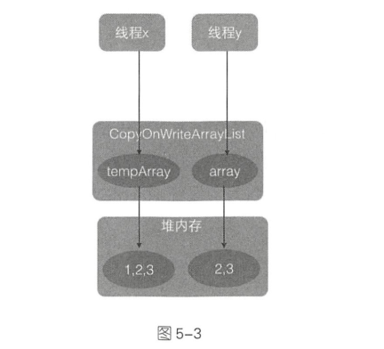

- [第5章-Java并发包中并发List源码剖析](#sec-1)
  - [介绍](#sec-1-1)
  - [主要方法源码解析](#sec-1-2)
    - [初始化](#sec-1-2-1)
    - [添加元素](#sec-1-2-2)
    - [获取指定位置元素](#sec-1-2-3)
    - [修改指定元素](#sec-1-2-4)
    - [删除元素](#sec-1-2-5)
    - [弱一致性的迭代器](#sec-1-2-6)
  - [总结](#sec-1-3)

# 第5章-Java并发包中并发List源码剖析<a id="sec-1"></a>

## 介绍<a id="sec-1-1"></a>

并发包中的并发List只有 `CopyOnWriteArrayList` 。 `CopyOnWriteArrayList` 是一个线程安全的 `ArrayList` ，对其进行修改操作都是在低层的一个复制的数组（快照）上进行的，使用了写时复制策略。

`ReentrantLock` 独占锁对象用来保证同时只有一个线程对 `array` 进行修改。

## 主要方法源码解析<a id="sec-1-2"></a>

### 初始化<a id="sec-1-2-1"></a>

无参构造函数

```java
public CopyOnWriteArrayList() {
    setArray(new Object[0]);
}
```

有参构造函数

```java
// 创建一个List，其内部元素是入参toCopyIn的副本
public CopyOnWriteArrayList(E[] toCopyIn) {
    setArray(Arrays.copyOf(toCopyIn, toCopyIn.length, Object[].class));
}


// 入参为集合，将集合里面的元素复制到本list
public CopyOnWriteArrayList(Collection<? extends E> c) {
    Object[] elements;
    if (c.getClass() == CopyOnWriteArrayList.class)
        elements = ((CopyOnWriteArrayList<?>)c).getArray();
    else {
        elements = c.toArray();
        // c.toArray might (incorrectly) not return Object[] (see 6260652)
        if (elements.getClass() != Object[].class)
            elements = Arrays.copyOf(elements, elements.length, Object[].class);
    }
    setArray(elements);
}
```

### 添加元素<a id="sec-1-2-2"></a>

```java
public boolean add(E e) {
    // 获取独占锁
    final ReentrantLock lock = this.lock;
    lock.lock();
    try {
        // 获取array
        Object[] elements = getArray();
        // 复制array到新数组，添加元素到新数组，复制了一个快照，然后再快照上进行添加元素。
        int len = elements.length;
        Object[] newElements = Arrays.copyOf(elements, len + 1);
        newElements[len] = e;
        // 使用新数组替换添加前的数组
        setArray(newElements);
        return true;
    } finally {
        lock.unlock();
    }
}
```

### 获取指定位置元素<a id="sec-1-2-3"></a>

```java
private E get(Object[] a, int index) {
    return (E) a[index];
}

public E get(int index) {
    return get(getArray(), index);
}

final Object[] getArray() {
    return array;
}
```

当线程x调用 `get` 方法获取指定位置的元素时，分两步

-   获取 `array` 数组。（步骤A）
-   通过下标访问指定位置的元素。（步骤B）

由于步骤A和步骤B没有加锁，可能导致在线程x执行完步骤A后执行步骤B前，另一个线程y进行了 `remove` 操作。

`remove` 操作首先先获取独占锁，然后进行写时复制操作，复制一份当前 `array` 数组，然后再复制的数组里面删除线程x通过 `get` 方法要访问的元素1，之后让 `array` 指向复制的数组。这时候 `array` 之前指向的数组的引用计数为1而不是为0，因为线程x仍在使用。线程x执行步骤B，步骤B操作的数组还是线程y删除元素之前的数组。 

### 修改指定元素<a id="sec-1-2-4"></a>

首先获取了独占锁，然后获取当前数组，并调用 `get` 方法获取指定位置的元素，如果指定位置的元素与新值不一致则创建新数组并复制元素，然后在新数组上修改指定位置的元素值并设置新数组到 `array` 。如果指定位置的元素值与新值一样，则为了保证 `volatile` 语义，还是需要重新设置 `array` ，虽然 `array` 的内容并没有改变。

```java
public E set(int index, E element) {
    final ReentrantLock lock = this.lock;
    lock.lock();
    try {
        Object[] elements = getArray();
        E oldValue = get(elements, index);

        if (oldValue != element) {
            int len = elements.length;
            Object[] newElements = Arrays.copyOf(elements, len);
            newElements[index] = element;
            setArray(newElements);
        } else {
            // Not quite a no-op; ensures volatile write semantics
            setArray(elements);
        }
        return oldValue;
    } finally {
        lock.unlock();
    }
}
```

### 删除元素<a id="sec-1-2-5"></a>

```java
public E remove(int index) {
    // 获取独占锁
    final ReentrantLock lock = this.lock;
    lock.lock();
    try {
        // 获取数组
        Object[] elements = getArray();
        int len = elements.length;

        // 获取指定元素
        E oldValue = get(elements, index);

        int numMoved = len - index - 1;
        // 如果要删除的元素是最后一个元素
        if (numMoved == 0)
            setArray(Arrays.copyOf(elements, len - 1));
        else {
            // 分两次复制删除后剩余的元素到新数组
            Object[] newElements = new Object[len - 1];
            System.arraycopy(elements, 0, newElements, 0, index);
            System.arraycopy(elements, index + 1, newElements, index,
                             numMoved);
            // 使用新数组代替老数组
            setArray(newElements);
        }
        return oldValue;
    } finally {
        // 释放锁
        lock.unlock();
    }
}
```

### 弱一致性的迭代器<a id="sec-1-2-6"></a>

弱一致性是指返回迭代器后，其他线程对list的增删改对迭代器是不可见的。

```java
public Iterator<E> iterator() {
    return new COWIterator<E>(getArray(), 0);
}


static final class COWIterator<E> implements ListIterator<E> {
    //array的快照版本
    private final Object[] snapshot;
    //数组下标
    private int cursor;

    // 构造函数
    private COWIterator(Object[] elements, int initialCursor) {
        cursor = initialCursor;
        snapshot = elements;
    }

    // 是否遍历结束
    public boolean hasNext() {
        return cursor < snapshot.length;
    }
    // 获取元素
    @SuppressWarnings("unchecked")
    public E next() {
        if (! hasNext())
            throw new NoSuchElementException();
        return (E) snapshot[cursor++];
    }
}
```

`iterator()` 方法获取迭代器时实际上会返回一个 `COWIterator` 对象， `COWIterator` 对象的 `snapshot` 变量保存了当前 `list` 的内容， `cursor` 是遍历 `list` 时数据的下标。

如果在该线程使用返回的迭代器遍历元素的过程中，其他线程没有对 `list` 进行增删改，那么 `snapshot` 本身就是 `list` 的 `array` ，因为它们是引用关系。

如果遍历期间其他线程对该list进行了增删改，那么 `snapshot` 就是快照了，因为增删改后 `list` 里面的数组呗新数组替换了，这时候老数组被 `snapshot` 引用。

获取迭代器后，使用该迭代器元素时，其他线程对该 `list` 进行了增删改不可见，因为它们操作的是两个不同的数组，这就是弱一致性。

## 总结<a id="sec-1-3"></a>

`CopyOnWriteArrayList` 使用写时复制的策略来保证 `list` 的一致性，获取-修改-写入三步操作并不是原子性的，所以在增删改的过程中都使用了独占锁，来保证了某个时间只有一个线程能对 `list` 数组进行修改。

`CopyOnWriteArrayList` 提供了弱一致性的迭代器，从而保证了在获取迭代器后，其他线程对 `list` 的修改是不可见的，迭代器遍历的数组是一个快照。
