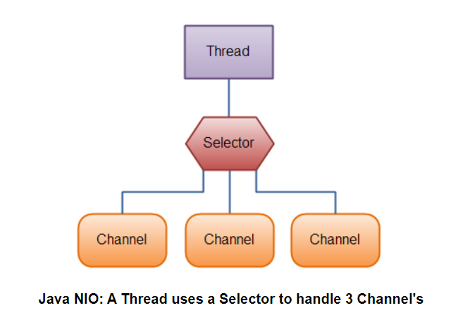

- [Java NIO 概述](#sec-1)
  - [Channels和Buffers](#sec-1-1)
  - [Selectors](#sec-1-2)

# Java NIO 概述

Java NIO 由以下核心组件构成

-   Channels
-   Buffers
-   Selectors

Java NIO有更多的类和组件，但是Channel，Buffer和Selector构成了API的核心。在我看来，像 `Pipe` 和 `FileLock` 只是三个核心组件一起使用的实用工具类

## Channels和Buffers

NIO中所有的IO都以 `Channel` 开头。Channel优点类似于流，数据可以从 `Channel` 中读入到 `Buffer` 。数据也可以从 `Buffer` 写入到 `Channel` 。

NIO有几种 `Channel` 和 `Buffer` 类型，下面是NIO中 `Channel` 的主要实现

-   FileChannel
-   DatagramChannel
-   SocketChannel
-   ServerSocketChannel

Java NIO中 `Buffer` 主要的实现

-   ByteBuffer
-   CharBuffer
-   DoubleBuffer
-   FloatBuffer
-   IntBuffer
-   LongBuffer
-   ShortBuffer

Java NIO中还有与内存映射文件一起使用的 `MappedByteBuffer` 。

## Selectors

一个 `Selector` 可以用单个线程去处理多个管道。

先通过注册管道的方式去使用 `Selector` ，然后调用 `select()` 方法。这个方法会阻塞直至其中一个已注册的管道准备好事件。一旦 `select()` 方法返回，这个线程可以继续处理线程自身的事件。
