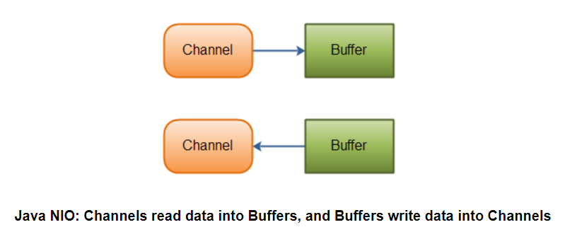

- [Java NIO Channel](#sec-1)
  - [Channel的实现](#sec-1-1)
  - [Channel的基本案例](#sec-1-2)

# Java NIO Channel<a id="sec-1"></a>

Java NIO的管道类似于流，以下是两者的区别

-   可以从管道中读写数据(双向)，流只能是读或写(单向的)
-   管道可以被异步的读和写
-   方向总是从管道读入数据到缓冲区，从缓冲区写入数据到管道中。



## Channel的实现<a id="sec-1-1"></a>

下面是NIO中 `Channel` 的主要实现

-   FileChannel
-   DatagramChannel
-   SocketChannel
-   ServerSocketChannel

`FileChannel` 可以从文件中读写数据。

`DatagramChannel` 可以通过UDP在网络上读写数据。

`SocketChannel` 可以通过TCP在网络上读写数据。

`ServerSocketChannel` 允许监听传入的TCP连接，像网络服务器一样。对每个传入的连接，都会创建一个 `SocketChannel`

## Channel的基本案例<a id="sec-1-2"></a>

```java
package channel;

import java.io.FileNotFoundException;
import java.io.IOException;
import java.io.RandomAccessFile;
import java.nio.ByteBuffer;
import java.nio.channels.FileChannel;

/**
 * @program: JavaNIO
 * @author: devinkin
 * @create: 2019-08-28 15:16
 * @description: Channel基本案例
 **/
public class BasicChannelExample {
    public static void main(String[] args) throws IOException {
        RandomAccessFile aFile = new RandomAccessFile("C:\\Users\\devinkin\\Learning\\JavaLearning\\JavaNIO\\src\\main\\resources\\data\\nio-data.txt", "rw");
        FileChannel inChannel = aFile.getChannel();

        ByteBuffer buf = ByteBuffer.allocate(48);

        int bytesRead = inChannel.read(buf);
        while (bytesRead != -1) {
            System.out.println("Read " + bytesRead);
            buf.flip();

            while (buf.hasRemaining()) {
                System.out.print((char)buf.get());
            }
            System.out.println();

            buf.clear();
            bytesRead = inChannel.read(buf);
        }
        aFile.close();
    }
}
```
