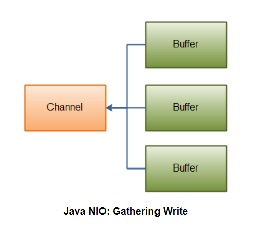

- [Java NIO Scatter / Gather](#sec-1)
  - [分散读取](#sec-1-1)
  - [收集写入](#sec-1-2)

# Java NIO Scatter / Gather<a id="sec-1"></a>

Java NIO具有内置的分散/聚集支持。分散/聚集这个概念用于从管道中读取数据或者写入数据到管道。

从管道分散读取数据是指将数据读入多个缓冲区的读取操作。因此，管道将数据切块后分散到多个缓冲区。

对管道的收集写入是一种将来自多个缓冲区的数据写入单个管道的写操作。因此，从多个缓冲区中收集数据后写入到管道。

## 分散读取<a id="sec-1-1"></a>

下图是分散读取的原理 

演示从管道分散读取的示例代码

```java
ByteBuffer header = ByteBuffer.allocate(128);
ByteBuffer body = ByteBuffer.allocate(1024);

ByteBuffer[] bufferArray = {header, body};

channel.read(bufferArray);
```

管道分散读取会先填充完某个buffer才会进入下一个缓冲区，意味着它不适合动态大小的消息。

## 收集写入<a id="sec-1-2"></a>

下图是收集写入的原理 

从多个缓冲区写入数据到管道的示例代码

```java
ByteBuffer header = ByteBuffer.allocate(128);
ByteBuffer body = ByteBuffer.allocate(1024);

ByteBuffer[] bufferArray = {header, body};

channel.write(bufferArray);
```

缓冲区数组参数传递给 `write()` 方法，该方法按照在数组中遇到的顺序写入缓冲区的内容。缓冲区只有在 `position` 和 `limit` 之间的数据会被写入。因此，收集写操作支持动态大小的消息。
