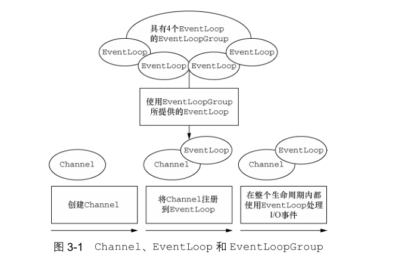
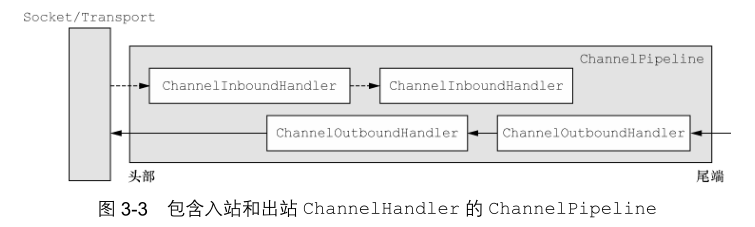
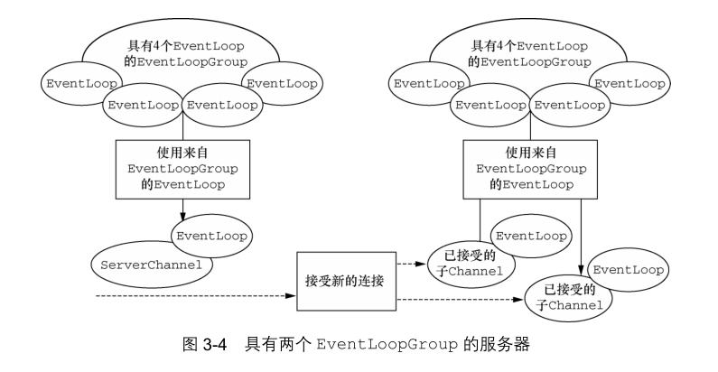

- [第3章-Netty的组件和设计](#sec-1)
  - [Channel, EventLoop和ChannelFuture](#sec-1-1)
    - [Channel接口](#sec-1-1-1)
    - [EventLoop接口](#sec-1-1-2)
    - [ChannelFuture接口](#sec-1-1-3)
  - [ChannelHandler和ChannelPipeline](#sec-1-2)
    - [ChannelHandler接口](#sec-1-2-1)
    - [ChannelPipeline接口](#sec-1-2-2)
    - [更加深入地了解ChannelHander](#sec-1-2-3)
    - [编码和解码器](#sec-1-2-4)
  - [引导](#sec-1-3)

# 第3章-Netty的组件和设计

## Channel, EventLoop和ChannelFuture

Channel对应Socket

EventLoop对应控制流, 多线程处理, 并发.

ChannelFuture对应异步通知.

### Channel接口

预定义的Channel, 简化了 `Socket` 类的复杂性

-   EmbeddedChannel
-   LocalServerChannel
-   NioDatagramChannel
-   NioSctpChannel
-   NioSocketChannel

### EventLoop接口

`EventLoop` 定义了Netty的核心抽象, 用于处理连接的生命周期所发生的事件.

Channel, EventLoop, Thread以及EventLoopGroup之间的关系

-   一个EventLoopGroup包含一个或多个EventLoop
-   一个EventLoop在它的生命周期内只和一个Thread绑定
-   所有的EventLoop处理的I/O事件都将在它专有的Thread上被处理
-   一个Channel在它的生命周期内只注册于一个EventLoop
-   一个EventLoop可能会被分配给一个或多个Channel

### ChannelFuture接口

Netty中所有的I/O操作都是异步的, 因为一个操作可能不会立即返回, 所以我们需要一种用于在之后的某个时间点确定其结果的方法.

Netty提供了 `ChannelFuture` 接口, 其 `addListener()` 方法注册了一个 `ChannelFutureListener` , 以便在某个操作完成时(无论是否成功)得到通知.

## ChannelHandler和ChannelPipeline

### ChannelHandler接口

Netty的主要组件是 `ChannelHandler` , 它充当了所有处理入站和出站数据的应用程序逻辑的容器.

### ChannelPipeline接口

`ChannelPipeline` 提供了 `ChannelHandler` 链的容器, 并定义了用于在该链上传播入站和出站事件流的API.

`ChannelHandler` 安装到 `ChannelPipeline` 中的过程如下

-   一个 `ChannelInitializer` 的实现被注册到了 `ServerBootStrap` 中
-   当 `ChannelInitializer.initChannel()` 方法被调用时, `ChannelInitializer` 将在 `ChannelPipeline` 中安装一组自定义的 `ChannelHandler`
-   `ChannelInitializer` 将它自己从 `ChannelPipeline` 中移除

如果事件的运动方向是从客户端到服务端的, 那么我们称这些事件为出站的, 反之, 则称为入站的. 

Netty只能区分 `ChannelInboundHandler` 实现和 `ChannelOutBoundHandler` 实现, 并确保数据只会在具有相同定向类型的两个 `ChannelHandler` 之间传递.

当 `ChannelHandler` 被添加到 `ChannelPipeline` 时, 它将会被分配一个 `ChannelHandlerContext` , 其代表了 `ChannelHandler` 和 `ChannelPipeline` 之间的绑定.

-   `ChannelHandlerContext` 可以获取底层的 `Channel` , 但是它主要还是被用于写出站的数据.

在 `Netty` 中, 有两种发送消息的方式

-   直接写到 `Channel` 中: 将会导致消息从 `ChannelPipeline` 尾端开始流动
-   写到相关联的 `ChannelHandlerContext` 对象中: 导致消息从 `ChannelPipeline` 中的下一个 `ChannelHandler` 开始流动.

### 更加深入地了解ChannelHander

编写自定义 `ChannelHandler` 时经常会用到的适配器类

-   ChannelHandlerAdapter
-   ChannelInboundHandler
-   ChannelOutBoundHandler
-   ChannelDuplexHandler

### 编码和解码器

出站消息会进行编码, 入站消息会进行解码, 网络数据传输总是一系列字节.

## 引导

Netty的引导类为应用程序网络层配置提供了容器, 这涉及将一个仅从绑定到某个指定端口(引导一个服务器), 或者将一个仅从连接到另一个运行在某个指定主机的指定端口上的进程(引导一个客户端).

比较BootStrap类

| 类别           | BootStrap  | ServerBootStrap |
|-------------- |---------- |--------------- |
| 网络编程中的作用 | 连接到远程主机和端口 | 绑定到一个本地端口 |
| EventLoopGroup | 1          | 2               |

`ServerBootStrap` 需要两个 `EventLoopGroup` , 是因为服务器需要两组不同的 `Channel`

-   第一组只包含一个 `ServerChannel` , 代表服务器自身的已绑定到某个本地端口的正在监听的套接字.
-   第二组将包含所有一创建的用来传入客户端连接(对于每个服务器已经接收了连接有一个)的Channel

