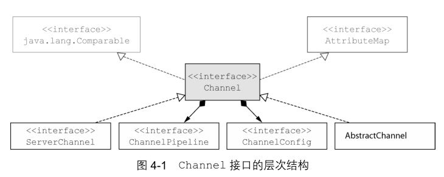

- [第4章-传输](#sec-1)
  - [传输API](#sec-1-1)
  - [内置的传输](#sec-1-2)
    - [NIO-非阻塞I/O](#sec-1-2-1)
    - [Epoll-用于Linux的本地非阻塞传输](#sec-1-2-2)
    - [OIO-旧的阻塞I/O](#sec-1-2-3)
    - [用于JVM内部通信的Local传输](#sec-1-2-4)
    - [Embedded传输](#sec-1-2-5)
  - [传输的用例](#sec-1-3)

# 第4章-传输

## 传输API

Channel接口层次结构 

每个 `Channel` 都会被分配一个 `ChannelPipeline` 和 `ChannelConfig` .

`ChannelConfig` 包含了该 `Channel` 的所有配置设置, 并且支持热更新.

由于 `Channel` 是独一无二的, 所以为了保证顺序将 `Channel` 声明为 `java.lang.Comparable` 的一个子接口.

`ChannelPipeline` 持有所有将应用于入站和出站数据以及事件 `ChannelHandler` 实例, 这些 `ChannelHandler` 实现了应用程序用于处理状态变化以及数据处理的逻辑.

`ChannelHandler` 的典型用途

-   将数据从一种格式转换为另一种格式
-   提供异常通知
-   提供Channel变为活动或者非活动的通知
-   提供当Channel注册到EventLoop或者从EventLoop注销时的通知
-   提供有关用户自定义事件的通知

Channel的方法

| 方法名        | 描述                                                                                           |
|------------- |---------------------------------------------------------------------------------------------- |
| eventLoop     | 返回分配给Channel的EventLoop                                                                   |
| pipeline      | 返回分配给Channel的ChannelPipeline                                                             |
| isActive      | 如果Channel是活动的, 则返回true, 活动的意义可能依赖于底层的传输. 例如, 一个Socket传输一旦连接了远程节点便是活动的, 而一个Datagram传输一旦被打开便是活动的 |
| localAddress  | 返回本地的SocketAddress                                                                        |
| remoteAddress | 返回远程的SocketAddress                                                                        |
| write         | 将数据写到远程节点. 这个数据将被传递给ChannelPipeline, 并且排队直到它被冲刷                    |
| flush         | 将之前已写的数据冲刷到底层传输, 如一个Socket                                                   |
| writeAndFlush | 一个简便的方法, 等同于调用write()并接着调用flush()                                             |

## 内置的传输

Netty所提供的传输

| 名称     | 包                          | 描述                                                                                        |
|-------- |--------------------------- |------------------------------------------------------------------------------------------- |
| NIO      | io.netty.channel.socket.nio | 使用java.nio.channels包作为基础-基于选择器的方式                                            |
| Epoll    | io.netty.channel.epoll      | 由JNI驱动的epoll()和非阻塞IO. 这种传输支持只有在Linux上可用的多种特性, 如SOREUSEPORT, 比NIO传输更快, 而且是完全非阻塞的. |
| OIO      | io.netty.channel.socket.oio | 使用java.net包作为基础-使用阻塞流                                                           |
| Local    | io.netty.channel.local      | 可以在VM内部通过管道进行通信的本地传输                                                      |
| Embedded | io.netty.channel.embedded   | Embedded传输, 允许使用ChannelHandler而又不需要一个真正的基于网络的传输. 这在测试你的ChannelHandler实现时非常有用 |

### NIO-非阻塞I/O

选择器背后的基本概念是充当一个注册表, 在那里你将请求在Channel的状态发送变化时得到通知, 可能变化的状态如下

-   新的Channel已被接受并且就绪
-   Channel连接已经完成
-   Channel有已经就绪的可供读取的数据
-   Channel可用于写数据

选择操作的位模式

| 名称                 | 描述                                                                            |
|-------------------- |------------------------------------------------------------------------------- |
| OPACCEPT  | 请求在接受新连接并创建Channel时获得通知                                         |
| OPCONNECT | 请求在建立一个新连接时获得通知                                                  |
| OPREAD    | 请求当数据已经就绪, 可以从Channel中读取时获得通知                               |
| OPWRITE   | 请求当可以向Channel中写更多的数据时获得通知.这处理了套接字缓冲区被完全填满时的情况, 这种情况通常发生在数据的发送速度比远程节点可处理的速度更快的时候 |

### Epoll-用于Linux的本地非阻塞传输

Epoll在高负载下的性能由于JDK的NIO实现

### OIO-旧的阻塞I/O

建立在 `java.net` 包的阻塞实现.

### 用于JVM内部通信的Local传输

Netty提供了一个Local传输, 用于在同一个JVM中运行的客户端和服务器程序之间的异步通信.

### Embedded传输

Netty提供了一种额外的传输, 使得你可以将一组 `ChannelHandler` 作为帮助类前入到其他的 `ChannelHandler` 内部.

## 传输的用例

应用程序的最佳传输

| 应用程序的需求      | 推荐的传输           |
|------------------- |-------------------- |
| 非阻塞代码块或者一个常规的起点 | NIO(或者Linux上使用epoll) |
| 阻塞代码库          | OIO                  |
| 在同一个JVM内部的通信 | Local                |
| 测试ChannelHandler的实现 | Embedded             |
