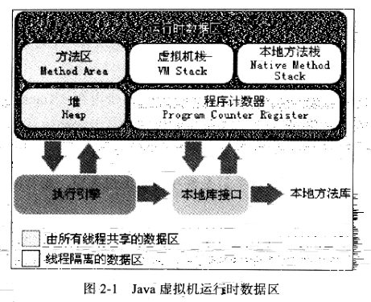
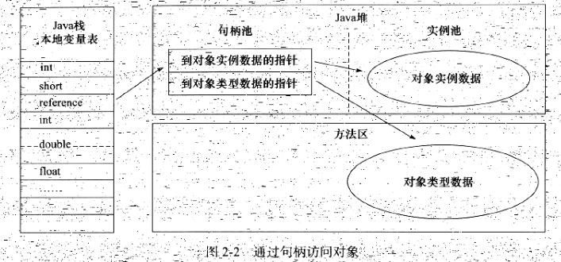
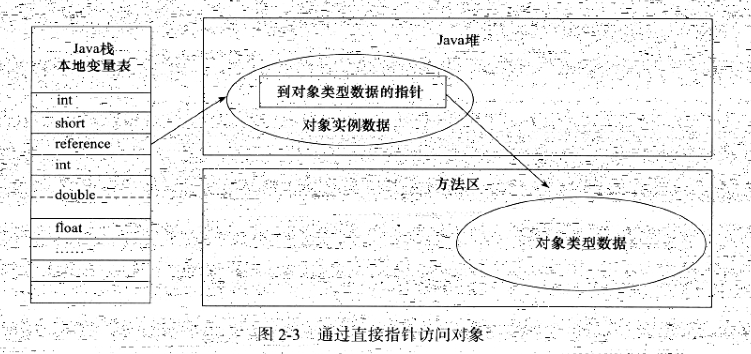

- [第2章-Java内存区域与内存溢出异常](#sec-1)
  - [运行时数据区域](#sec-1-1)
    - [程序计数器](#sec-1-1-1)
    - [Java虚拟机栈](#sec-1-1-2)
    - [本地方法栈](#sec-1-1-3)
    - [Java堆](#sec-1-1-4)
    - [方法区](#sec-1-1-5)
    - [运行时常量池](#sec-1-1-6)
    - [直接内存](#sec-1-1-7)
  - [HotSpot虚拟机对象探秘](#sec-1-2)
    - [对象的创建](#sec-1-2-1)
    - [对象的内存布局](#sec-1-2-2)
    - [对象的访问定位](#sec-1-2-3)
  - [实战：OutOfMemoryError异常](#sec-1-3)
    - [Java堆溢出](#sec-1-3-1)
    - [虚拟机栈和本地方法栈溢出](#sec-1-3-2)
    - [方法区和运行时常量池溢出](#sec-1-3-3)
    - [本机直接内存溢出](#sec-1-3-4)

# 第2章-Java内存区域与内存溢出异常<a id="sec-1"></a>

## 运行时数据区域<a id="sec-1-1"></a>

JavaSE7 虚拟机包括以下几个运行时数据区域 

### 程序计数器<a id="sec-1-1-1"></a>

程序计数器是一块较小的内存空间，可以看作当前线程锁执行的字节码的行号指示器。

因为Java虚拟机的多线程是通过线程轮流切换并分配处理器执行时间的方式来实现的，在任何一个确定的时刻，一个处理器(单核)都只会执行一条线程中的指令。

因此，为了线程切换后能恢复到正常的执行位置，每条线程都需要一个独立的程序计数器，各条线程之间计数器互不影响，独立存储，这类内存区域为“线程私有”的内存。

如果线程正在执行的是 `Native` 方法，这个计数器值为空( `Undefined` ) 。

程序计数器是唯一一个在Java虚拟机规范没有规定任何 `OutOfMemoryError` 情况的区域。

### Java虚拟机栈<a id="sec-1-1-2"></a>

Java虚拟机栈也是线程私有的，它的声明周期与线程相同。

虚拟机栈描述的是Java方法执行的内存模型：每个方法在执行的同时都会创建一个栈帧(Stack Frame)用于存储变量表，操作数栈、动态链接、方法出口等信息。

这里的“栈”是指虚拟机栈中局部变量表部分。

局部变量表存放编译器可知的

-   各种基本数据类型(boolean、byte、char、short、int、float、long、double)
-   对象引用(reference类型，它不等同于对象本身，可能是一个指向对象起始地址的引用指针，也可能是指向一个代表对象的句柄或其他于此对象相关的位置)
-   `returnAddress` 类型(指向了一条字节码指令的地址)

局部变量所需的内存空间在编译期间完成分配，当进入一个方法时，这个方法需要在帧中分配多大的局部变量空间是完全确定的。

在Java虚拟机规范中，对这个区域规定了两种异常情况

-   当线程请求的栈深度大于虚拟机锁允许的深度，将抛出 `StackOverflowError` 异常。
-   如果虚拟机栈可以动态扩展，如果扩展时无法申请到足够的内存，就会抛出 `OutOfMemoryError` 异常。

### 本地方法栈<a id="sec-1-1-3"></a>

本地方法栈与虚拟机栈发挥的作用类似，但区别在于

-   虚拟机栈为虚拟机执行Java方法(也就是字节码)服务
-   本地方法栈则为虚拟机使用到的 `Native` 方法服务。

在虚拟机规范中对本地方法栈中方法使用的语言、使用方式与数据结构没有强制规定，因此具体的虚拟机可以自由实现它。

本地方法栈也会抛出 `StackOverflowError` 和 `OutOfMemoryError` 异常。

### Java堆<a id="sec-1-1-4"></a>

Java对是Java虚拟机所管理内存中最大的一块，Java堆是被所有线程共享的一块内存区域。

Java堆是内存收集器管理的主要区域，因此很多时候被称为“GC堆”。

Java堆可以细分为新生代和老年代，再细分由 `Eden空间` 、 `From Survivor空间` 、 `To Survivor空间` 等

Java堆可以处于物理上不连续的内存空间中，只要逻辑上是连续的即可。

如果堆中没有内存完成实例分配，并且堆也无法再扩展时，就会抛出 `OutOfMemoryError` 异常。

### 方法区<a id="sec-1-1-5"></a>

方法区也是各个线程共享的内存区域，它用于存储已被虚拟机加载的类信息、常量、静态变量、即时编译器编译后的代码等数据。

如何实现方法区属于虚拟机实现细节，不受虚拟机规范约束，HotSpot虚拟机有逐步放弃方法区永久代改采用 `Native Memory` 来实现方法区的规划了。

根据Java虚拟机规范的规定，当方法区无法满足内存分配需求时候，将抛出 `OutOfMemoryError` 异常。

### 运行时常量池<a id="sec-1-1-6"></a>

运行时常量池是方法区的一部分， `Class` 文件中除了有类的版本、字段、方法、接口等描述信息外，还有一项信息是常量池，用于存放编译器生成的各种字面量和符号引用，这部分内容将在类加载后进入方法区的运行时常量池中存放。

运行时常量池相对Class文件常量池的另一个重要特征是具备动态性。运行期间也可能将新的常量放入池中。

当常量池无法再申请到内存时会抛出 `OutOfMemoryError` 异常。

### 直接内存<a id="sec-1-1-7"></a>

直接内存并不是虚拟机运行时数据区的一部分，也不是Java虚拟机规范中定义的内存区域。

JDK1.4新加入的NIO类，它可以使用 `Native` 函数库直接分配堆外内存，然后通过一个存储再Java堆中的 `DirectByteBuffer` 对象作为这块内存的引用进行操作。

本机直接内存的分配不会受到Java堆大小的限制，会收到本机总内存大小的限制。

如果各内存区域总和大于物理内存限制(包括物理和操作系统级的限制)，从而导致动态扩展时出现 `OutOfMemoryError` 异常。

## HotSpot虚拟机对象探秘<a id="sec-1-2"></a>

### 对象的创建<a id="sec-1-2-1"></a>

虚拟机遇到一条 `new` 指令时，先区检查这个指令的参数能否再常量池中定位到一个类的符号引用，并且检查这个符号引用代表的类是否已被加载、解析和初始化过。

类加载检查通过后，为对象分配内存空间。

-   Java堆中的内存是绝对规整的，会使用指针碰撞分配方式，指针向空闲空间那边挪动一段与对象大小相等的距离。
-   Java堆中的内存并不规整，会使用空闲列表分配方式。

对象创建在虚拟机虚拟机是非常频繁的行为，在并发的情况下是线程不安全的：A正分配内存，指针还没来得及修改，B又使用了原来的指针来分配内存。解决方案有两种

-   堆分配内存空间的动作进行同步处理，虚拟机采用CAS配上失败重试的方式保证更新操作原子性。
-   把内存分配的动作按照线程划分在不同的空间中，即每个线程在Java堆中先预先分配一小块内存，称为本地线程分配缓冲(Thread Local Allocation Buffer, `TLAB` )。只有 `TLAB` 用完并重新分配新的 `TLAB` 时，才需要同步锁定。

虚拟机是否使用 `TLAB` ，可以通过 `-XX:+/-UseTLAB` 参数来设定。

### 对象的内存布局<a id="sec-1-2-2"></a>

在 `Hotspot` 虚拟机，对象在内存中存储的布局可以分为3块区域：

-   对象头
-   实例数据
-   对齐填充

`Hotspot` 虚拟机的对象头包括两部分信息：

-   用于存储对象自身的运行时数据：如哈希码、GC粉黛年龄、锁状态标志、线程持有的锁、偏向线程ID、偏向时间戳等，这部分数据长度在32位和64位虚拟机(未开启压缩指针)中分别位32bit和64bit。
-   另一部分是类型指针，即对象指向它类元数据的指针，虚拟机通过这个指针来确定这个对象是哪个类的实例。

实例数据部分是对象真正存储的有效信息，在程序代码中所定义的各种类型的字段内容。这部分的存储顺序会收到虚拟机分配策略参数(FieldsAllocationStyle)和字段在Java源码中定义顺序的影响。

-   分配策略是相同宽度的字段总是被分配到一起，满足这个前提下，在父类中定义的变量会出现在子类之前。
-   如果 `CompactFields` 参数值位true(默认为true)，那么子类中较窄的变量也可能会插入到父类的空隙中。

对齐填充并不是必然存在的，仅起到占位符的作用。

-   `Hotspot VM` 的自动内存管理系统要求对象起始地址必须是8字节的整数倍。对象大小必须是8字节的整数倍。
-   对象头部分正好是8字节的倍数(32bit或者64bit)。
-   实例数据没有对齐，就需要通过对齐填充来补全。

### 对象的访问定位<a id="sec-1-2-3"></a>

对象的访问方式取决于虚拟机实现，目前驻留的访问方式有使用句柄和直接指针两种。

如果使用句柄，那么Java堆中将会划分出一块内存来作为句柄池， `reference` 中存储的就是对象的句柄地址，而句柄中包含了对象实例数据和类型数据各自的具体信息 

如果使用直接指针访问，那么Java堆对象的布局就必须考虑如何防止访问类型数据的相关信息，而 `reference` 中存储的直接就是对象地址。 

使用句柄来访问最大的好处是 `reference` 中存储的是稳定的句柄，在对象被移动(垃圾收集时移动对象是非常普遍的行为)时只会改变句柄中的实例数据指针，而 `reference` 本身不需要修改。

直接指针访问最大的好处是速度更快，它节省了一次指针定位的时间开销。

## 实战：OutOfMemoryError异常<a id="sec-1-3"></a>

### Java堆溢出<a id="sec-1-3-1"></a>

Java堆用于存储对象实例，只要不断地创建对象，并且保证GC Roots到对象之间有可达路径来避免垃圾回收机制清楚这些对象，那么在对象数量到达最大堆容量限制后就会产生内存溢出异常。

```java
package chapter2.oom;

import java.util.ArrayList;
import java.util.List;

/**
 * @program: UnderstandingJVM
 * @author: devinkin
 * @create: 2019-08-08 18:01
 * @description: 堆OOM测试
 * VM Args: -Xms20m -Xmx20m -XX:+HeapDumpOnOutOfMemoryError
 **/
public class HeapOOM {
    static class OOMObject {

    }

    public static void main(String[] args) {
        List<OOMObject> list = new ArrayList<>();
        while (true) {
            list.add(new OOMObject());
        }
    }
}
```

### 虚拟机栈和本地方法栈溢出<a id="sec-1-3-2"></a>

由于 `HotSpot` 虚拟机中并不区分虚拟机栈和本地方法站，因此对 `HotSpot` 来说，虽然 `-Xoss` 参数(设置本地方法栈大小)存在，但实际上是无效的，栈容量只由 `-Xss` 参数设定。

关于虚拟机栈和本地方法栈，在Java虚拟机规范中描述了两种异常

-   如果线程请求的栈深度大于虚拟机所允许的最大深度，将抛出 `StackOverflowError` 异常。
-   如果虚拟机在扩展栈时无法申请到足够的内存空间，则抛出 `OutOfMemoryError` 异常。

虚拟机栈和本地方法栈OOM测试， `-Xss` 参数设置栈内存容量。

```java
package chapter2.oom;

/**
 * @program: UnderstandingJVM
 * @author: devinkin
 * @create: 2019-08-09 09:36
 * @description: 虚拟机栈和本地方法栈OOM测试类
 * VM Args: -Xss128k
 **/
public class JavaVMStackSOF {
    private int stackLength = 1;

    public void stackLeak() {
        stackLength++;
        stackLeak();
    }

    public static void main(String[] args) {
        JavaVMStackSOF oom = new JavaVMStackSOF();
        try {
            oom.stackLeak();
        } catch (Throwable e) {
            System.out.println("stack length: " + oom.stackLength);
            throw e;
        }
    }
}
```

如果测试时不限于单线程，通过不断地创建线程的方式可以产生内存溢出异常。

在开发多线程的应用时，如果出现 `StackOverflowError` 异常时有错误堆栈可以阅读，比较容易找到问题的所在。

创建线程导致内存溢出异常

```java
package chapter2.oom;

/**
 * @program: UnderstandingJVM
 * @author: devinkin
 * @create: 2019-08-09 09:44
 * @description: 创建线程导致内存溢出异常
 * VM Args: -Xss2M(不妨设置大一些)
 **/
public class JavaVMStackOOM {
    private void dontStop() {
        while (true) {

        }
    }

    public void stackLeakByThread() {
        while (true) {
            Thread thread = new Thread(() -> {
                    dontStop();
            });
            thread.start();
        }
    }

    public static void main(String[] args) {
        JavaVMStackOOM oom = new JavaVMStackOOM();
        oom.stackLeakByThread();
    }
}
```

### 方法区和运行时常量池溢出<a id="sec-1-3-3"></a>

`String.intern()` 是一个 `Native` 方法，作用是：如果这个字符串常量池中已经包含了一个等于此String对象的字符串，则返回代表池中这个字符串String对象，否则，将此String对象包含的字符串添加到常量池中，并且返回此String对象的引用。

`-XX:PermSize` 和 `-XX:MaxPermSize` 限制方法区大小，从而间接限制其中常量池的容量。

JDK8去除了永久代，使用了元空间进行进行替代。 `-XX:MaxMetaspaceSize` 和 `-XX:MetaspaceSize` 限制方法区大小。

运行时常量池导致的内存溢出异常，JDK8已经去除了永久代，使用元空间代替了。

```java
package chapter2.oom;

import java.util.ArrayList;
import java.util.List;

/**
 * @program: UnderstandingJVM
 * @author: devinkin
 * @create: 2019-08-09 09:54
 * @description: 运行时常量池内存溢出异常
 * VM Args(JDK7): -XX:PermSize=10M -XX:MaxPermSize=10M
 * VM Args(JDK8): -XX:MetaspaceSize=10M -XX:MaxMetaspaceSize=10M
 **/
public class RunTimeConstantPoolOOM {
    public static void main(String[] args) {
        // 使用List保持常量池引用，避免Full GC回收常量池行为
        List<String> list = new ArrayList<>();
        // 10Mb的PermSize在integer范围内足够产生OOM了
        int i = 0;
        while (true) {
            list.add(String.valueOf(i++).intern());
        }
    }
}
```

`String.intern()` 返回引用测试

```java
package chapter2.oom;

/**
 * @program: UnderstandingJVM
 * @author: devinkin
 * @create: 2019-08-09 10:11
 * @description: String.intern()返回引用的测试
 **/
public class StringInternReturnTest {
    public static void main(String[] args) {
        String str1 = new StringBuilder("计算机").append("软件").toString();
        System.out.println(str1.intern() == str1);

        String str2 = new StringBuilder("ja").append("va").toString();
        System.out.println(str2.intern() == str2);
    }
}
```

在JDK1.6中运行，会得到两个 `false` 。在JDK1.7中运行，会得到一个 `true` 和一个 `false` 。

-   在JDK1.6中， `intern()` 方法会把首次遇到的字符串实例复制到永久代中，返回的也是永久代中这个字符串实例的引用，而由 `StringBuilder` 创建的字符串实例在Java堆中，必然不是同一个引用，将返回 `false` 。
-   在JDK1.7以后， `inter()` 实现不会再复制实例，只是再常量池中记录首次出现的实例引用，因此 `intern()` 返回的引用和由 `StringBuilder` 创建的那个字符串实例是同一个。 `str2` 比较返回 `false` 是因为 `"java"` 这个字符串再执行 `StringBuilder.toString()` 之前就已经出现过了，所以字符串常量池中已经有它的引用了，两个引用不一致。

方法区用于存放 `Class` 的相关信息，如类名、访问修饰符、常量池、字段描述、方法描述等。

借助 `CGLib` 使方法区出现内存溢出异常。

```java
package chapter2.oom;

import net.sf.cglib.proxy.Enhancer;
import net.sf.cglib.proxy.MethodInterceptor;
import net.sf.cglib.proxy.MethodProxy;

import java.lang.reflect.Method;

/**
 * @program: UnderstandingJVM
 * @author: devinkin
 * @create: 2019-08-09 10:22
 * @description: 借助CGLib使方法区出现内存溢出异常
 * VM Args(JDK7): -XX:PermSize=10M -XX:MaxPermSize=10M
 * VM Args(JDK8): -XX:MetaspaceSize=10M -XX:MaxMetaspaceSize=10M
 **/
public class JavaMethodAreaOOM {
    public static void main(String[] args) {
        while (true) {
            Enhancer enhancer = new Enhancer();
            enhancer.setSuperclass(OOMObject.class);
            enhancer.setUseCache(false);
            enhancer.setCallback(new MethodInterceptor() {
                @Override
                public Object intercept(Object o, Method method, Object[] objects, MethodProxy methodProxy) throws Throwable {
                    return methodProxy.invoke(o, args);
                }
            });
            enhancer.create();
        }
    }

    static class OOMObject {

    }
}
```

### 本机直接内存溢出<a id="sec-1-3-4"></a>

直接内存容量可以通过 `-XX:MaxDirectMemorySize` 指定，如果不指定，则默认与Java堆最大值 (`-Xmx` 指定)一样。

使用 `unsafe` 分配本机内存

```java
package chapter2.oom;

import sun.misc.Unsafe;

import java.lang.reflect.Field;

/**
 * @program: UnderstandingJVM
 * @author: devinkin
 * @create: 2019-08-09 10:50
 * @description: 直接内存溢出，使用unsafe分配本机内存
 * VM Args：-Xms20M -XX:MaxDirectMemorySize=10M
 **/
public class DirectMemoryOOM {
    private static final int _1MB = 1024 * 1024;

    public static void main(String[] args) throws IllegalAccessException {
        Field unsafeField = Unsafe.class.getDeclaredFields()[0];
        unsafeField.setAccessible(true);
        Unsafe unsafe = (Unsafe) unsafeField.get(null);
        while (true) {
            unsafe.allocateMemory(_1MB);
        }
    }
}
```

由 `DirectMemory` 导致的内存溢出，一个明显的特征是再 `Heap Dump` 文件中不会看到明显的异常。

如果发现 `OOM` 之后 `Dump` 文件很小，而程序又直接或间接使用了 `NIO` ，可以考虑是否为直接内存溢出。
