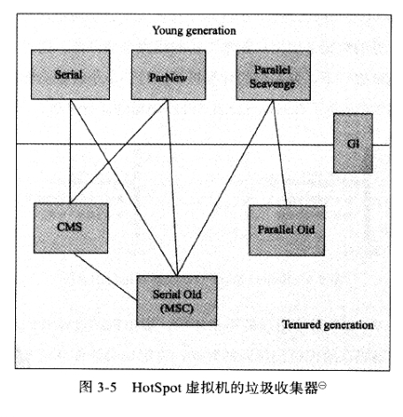
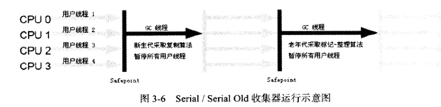
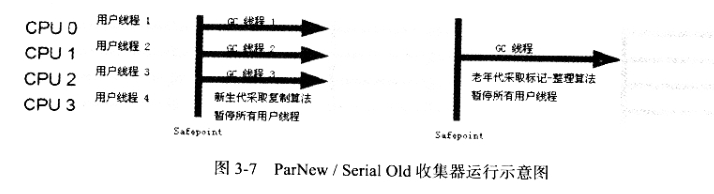
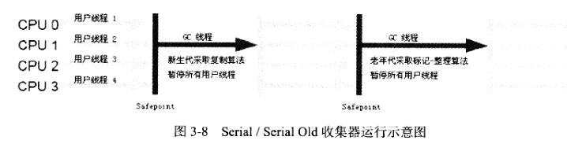
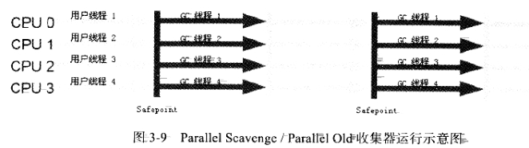
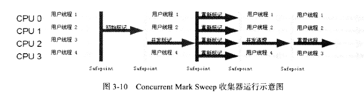
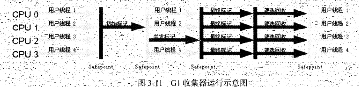

- [第3章-垃圾收集器与内存分配策略](#sec-1)
  - [对象已死吗](#sec-1-1)
    - [引用计数法](#sec-1-1-1)
    - [可达性分析算法](#sec-1-1-2)
    - [再谈引用](#sec-1-1-3)
    - [生存还是死亡](#sec-1-1-4)
    - [回收方法区](#sec-1-1-5)
  - [垃圾收集算法](#sec-1-2)
    - [标记-清除算法](#sec-1-2-1)
    - [复制算法](#sec-1-2-2)
    - [标记整理算法](#sec-1-2-3)
    - [分代收集算法](#sec-1-2-4)
  - [HotSpot的算法实现](#sec-1-3)
    - [枚举根节点](#sec-1-3-1)
    - [安全点](#sec-1-3-2)
    - [安全区域](#sec-1-3-3)
  - [垃圾收集器](#sec-1-4)
    - [Serial收集器](#sec-1-4-1)
    - [ParNew收集器](#sec-1-4-2)
    - [Parallel Scavenge收集器](#sec-1-4-3)
    - [Serial Old收集器](#sec-1-4-4)
    - [Parallel Old收集器](#sec-1-4-5)
    - [CMS收集器](#sec-1-4-6)
    - [G1收集器](#sec-1-4-7)
    - [理解GC日志](#sec-1-4-8)
    - [垃圾收集器参数总结](#sec-1-4-9)
  - [内存分配与回收策略](#sec-1-5)
    - [对象优先在Eden分配](#sec-1-5-1)
    - [大对象直接进入老年代](#sec-1-5-2)
    - [长期存活的对象将进入老年代](#sec-1-5-3)
    - [动态对象年龄判定](#sec-1-5-4)
    - [空间分配担保](#sec-1-5-5)

# 第3章-垃圾收集器与内存分配策略<a id="sec-1"></a>

## 对象已死吗<a id="sec-1-1"></a>

### 引用计数法<a id="sec-1-1-1"></a>

引用计数法的缺陷示例代码，循环引用

```java
package chapter3.refcount;

/**
 * @program: UnderstandingJVM
 * @author: devinkin
 * @create: 2019-08-13 09:57
 * @description: 引用计数的缺陷
 * VM Args：-XX:+PrintGCDetails
 **/
public class ReferenceCountingGC {
    public Object instance = null;

    private static final int _1MB = 1024 * 1024;

    private byte[] bigSize = new byte[2 * _1MB];

    public static void testGC() {
        ReferenceCountingGC objA = new ReferenceCountingGC();
        ReferenceCountingGC objB = new ReferenceCountingGC();

        objA.instance = objB;
        objB.instance = objA;

        // 假设在这里发生GC，objA和objB是否能被回收
        System.gc();
    }

    public static void main(String[] args) {
        testGC();
    }
}
```

### 可达性分析算法<a id="sec-1-1-2"></a>

可达性分析(Reachability Analysis)的基本思路是通过一系列的称为"GC Roots"的对象作为起始点，从这些节点开始向下搜索，搜索所走的路径称为引用链(Reference Chain)，当一个对象到 `GC Roots` 没有任何i也能用连相连时，则证明此对象不可用。

在Java语言中，可作为 `GC Roots` 的对象包括下面几种

-   虚拟机栈(栈帧中的本地变量表)中引用的对象
-   方法区中静态属性引用的对象
-   方法区中常量引用的对象
-   本地方法栈中 `JNI` (即一般说的 `Native` 方法)引用的对象

### 再谈引用<a id="sec-1-1-3"></a>

JDK1.2后，将引用分为了4种，强弱如下逐渐减弱

-   强引用
-   软引用
-   弱引用
-   虚引用

强引用就是指在程序代码之中普遍存在的，类似 `Object object = new Object()` 这类的引用，只要强引用还存在，垃圾收集永远不会回收掉被引用的对象。

软引用是用来描述一些还有用但并非必须的对象。对软引用关联着的对象，在系统将要发生内存溢出异常之前，将这些对象列进回收返回之中进行第二次回收。在JDK1.2之后，提供了 `SoftReference` 类来实现软引用。

弱引用也是用来描述非必须对象的，但它的强度比弱引用更弱一些，被弱引用关联的对象只能生存到下一次垃圾收集发生之前。当垃圾收集器工作时，无论当前内存是否足够，都会回收掉只被弱引用关联的对象。在JDK1.2之后，提供了 `WeekReference` 类来实现软引用。

虚引用也成为幽灵引用和幻影引用，它是最弱的一种引用关系。一个对象是否有虚引用的存在，完全不会对其生存时间构成影响，也无法通过虚引用来取得一个对象实例。为一个对象设置虚引用关联的唯一目的就是能在这个对象被垃圾回收时收到一个系统通知。在JDK1.2之后，提供了 `PhantomReference` 类来实现软引用。

### 生存还是死亡<a id="sec-1-1-4"></a>

可达性分析算法中不可达的对象，需要被标记两次，才宣告死亡。

-   如果对象在进行可达性分析后发现没有与 `GC Roots` 相连接的引用链，那么它将会被第一次标记且进行一次筛选，筛选的条件是此对象是否有必要执行 `finalize()` 方法。
-   当对象没有覆盖 `finalize()` 方法或者 `finalize()` 方法已经被虚拟机调用过，虚拟机将这两种情况都视为“没有必要执行”。

如果这个对象被判定为有必要执行 `finalize()` 方法，那么这个对象会放置一个叫做 `F-Queue` 队列中，并稍后由一个由虚拟机自动建立的、低优先级的 `Finalizer` 线程去执行它。虚拟机会触发 `finalize()` 方法，但不承诺会等待它运行结束。

`finalize()` 方法是对象逃脱死亡命运的最后一次机会，稍后GC将对 `F-Queue` 中的对象进行第二次小规模的标记，如果对象要在 `finalize()` 中成功拯救自己，只要重新与引用链上的任何一个对象建立关联即可。第二次标记时它将被移除出“即将回收”的集合。

任何一个对象的 `finalize()` 方法都只会被系统自动调用一次。

一次对象自我拯救的演示。

```java
package chapter3.selfsave;

/**
 * @program: UnderstandingJVM
 * @author: devinkin
 * @create: 2019-08-13 10:48
 * @description: 一次对象自我拯救的演示
 * 1. 对象可以在被GC时自我拯救
 * 2. 这种自救的机会只有一次，因为一个对象的finalize()方法最多只会被系统自动调用一次
 **/
public class FinalizeEscapeGC {
    public static FinalizeEscapeGC SAVE_HOOK = null;

    public void isAlive() {
        System.out.println("yes, i am still alive :)");
    }

    @Override
    protected void finalize() throws Throwable {
        super.finalize();
        System.out.println("finalize method executed!");
        FinalizeEscapeGC.SAVE_HOOK = this;
    }

    public static void main(String[] args) throws InterruptedException {
        SAVE_HOOK = new FinalizeEscapeGC();

        // 对象第一次成功拯救自己
        SAVE_HOOK = null;
        System.gc();
        // 因为finalize方法优先级很低，所以暂停0.5秒以等待它
        Thread.sleep(500);
        if (SAVE_HOOK != null) {
            SAVE_HOOK.isAlive();
        } else {
            System.out.println("no, i am dead :(");
        }

        // 下面这段代码与上面的完全相同，但是这次自己失败了
        SAVE_HOOK = null;
        System.gc();
        // 因为finalize方法优先级很低，所以暂停0.5秒以等待它
        Thread.sleep(500);
        if (SAVE_HOOK != null) {
            SAVE_HOOK.isAlive();
        } else {
            System.out.println("no, i am dead :(");
        }
    }
}

```

### 回收方法区<a id="sec-1-1-5"></a>

判断一个类是否是“无用的类”，类需要满足以下3个条件

-   该类的所有实例都已经被回收，也就是Java堆中不存在该类的任何实例。
-   加载该类的 `ClassLoader` 已经被回收。
-   该类对应的 `java.lang.Class` 对象没有任何地方被引用，无法在任何地方通过反射访问该类。

HotSpot虚拟机提供了 `Xnoclassgc` 参数控制对类进行回收。

可以使用 `verbose:class` 以及 `-XX:+TraceClassLoading` ， `XX:+TraceClassUnLoading` 查看类加载和卸载信息。

## 垃圾收集算法<a id="sec-1-2"></a>

### 标记-清除算法<a id="sec-1-2-1"></a>

算法分为“标记”和“清除”两个阶段。

-   标记所需要回收的对象，在标记完成后统一回收所有被标记的对象。

该算法的缺点：

-   效率不高。
-   产生大量不连续的内存碎片。

### 复制算法<a id="sec-1-2-2"></a>

复制算法将可用内存按容量划分为大小相等的两块，每次只是用其中的一块，当一个内存使用完了，九江还存货的都西昂复制到另一块上面，然后再把使用过的内存空间一次清理掉。

### 标记整理算法<a id="sec-1-2-3"></a>

标记整理算法是先标记所需回收的对象，让所有存货的对象都向一段移动，然后直接清理掉边界以外的内存。

### 分代收集算法<a id="sec-1-2-4"></a>

分代收集算法只是根据对象存货周期的不同将内存划分为几块。一般把Java堆分为新生代和老年代，根据各个年代的特点采用最适当的收集算法。

-   在新生代中，每次垃圾收集时发现有大批对象死去，只有少量存活，那就选用复制算法。
-   老年代中，对象存活率高、没有额外空间对它进行分配，必须采用"标记-清理“ 或者”标记-整理“算法来执行回收。

## HotSpot的算法实现<a id="sec-1-3"></a>

### 枚举根节点<a id="sec-1-3-1"></a>

可达性分析对执行时间的敏感还体现在GC停顿，因为这项工作必须在一个能确保一致性的快照中进行。

上面的“一致性”是指整个分析期间整个执行系统看起来就像被冻结在某个时间点上，不可以出现分析过程中对象引用关系还在不断变化的情况。这点导致GC进行时必须停顿所有Java执行线程(Stop The World)。

枚举根节点时候是必须要停顿的。

在HotSpot的实现中，使用一组称为 `OopMap` 的数据结构来存放着对象的引用。类加载完时，HotSpot就把对象内什么偏移量上是什么类型的数据计算出来，JIT编译过程中，也会在特定的位置记录下栈和寄存器中哪些位置是引用。

### 安全点<a id="sec-1-3-2"></a>

HotSpot没有为每条指令都生成 `OopMap` ，只是在“特定的位置”记录了这些信息，这个位置称为安全点(Safepoint)。

即程序执行时并非所有地方都能停顿下来开始GC，只有到达了安全点时才能暂停。

`Safepoint` 选定不能太少以至于让GC等待时间太长，也不能过于频繁以至于过大增大运行时的符合。

`Safepoint` 的选定基本上以程序“是否具有让程序长时间执行的特征”为标准选定的。

“长时间执行”最明显的特征就是指令序列符用，如

-   方法调用
-   循环跳转
-   异常跳转

对于 `Safepoint` 还需要考虑的问题是如何在GC发生时让所有线程(不包括JNI调用的线程)都跑到最近的安全点上再停顿下来。有两个方案

-   抢占式中断(Preemptive Suspension)
-   主动式中断(Volumntary Supension)

抢占式中断不需要线程的执行代码主动区配合，在GC发生时，首先把所有线程全部中断，如果发现有线程中断的地方不在安全点上，就恢复线程，让它“跑”到安全点上。现在几乎没有虚拟机实现采用抢先式中断来暂停线程从而响应GC事件。

主动式中断的思想是当GC需要中断线程的时候，不直接对线程操作，仅仅简单地设置一个标志，各个线程执行时主动去轮询这个标志，发现中断标志为真时就自己中断挂起。轮询标志的地方和安全点是重合的，另外再加上创建对象需要分配内存的地方。

### 安全区域<a id="sec-1-3-3"></a>

`Safepoint` 机制保证了程序执行时，在不太长的时间内就会遇到可进入GC的 `Safepoint` 。

程序在没有分配到CPU时间时候(程序不执行)，线程处于 `Sleep` 状态或者 `Blocked` 状态，这时线程无法响应JVM的中断请求，“走”到”安全的地方去中断挂起。

安全区域(Safe Region)是指在一段代码片段中，引用关系不会发生变化。在这个区域中的任意地方开始GC都是安全的，我们可以把 `Safe Region` 看作是被扩展了的 `Safepoint` 。

在线程执行到 `Safe Region` 中的代码时，首先标识自己已经进入了 `Safe Region` ，那样，当在这段时间里JVM要发起GC时，就不用管标识自己为 `Safe Region` 状态的线程了。在线程要离开 `Safe Region` 时，它要检查系统是否已经完成了根节点枚举(或者整个GC过程)，如果完成了，那线程就继续执行，否则它就必须等待直到收到可以安全离开 `Safe Region` 的信号为止。

## 垃圾收集器<a id="sec-1-4"></a>

JDK1.7Update14之后的HotSpot虚拟机的垃圾收集器。互相连线可以搭配使用。 

### Serial收集器<a id="sec-1-4-1"></a>

`Serial` 收集器是虚拟机新生收集的唯一选择。该收集器是单线程的收集器。

`Serial` 收集器不仅只会使用一个CPU或一条收集线程去完成垃圾收集工作，它进行垃圾收集时，必须暂停其他所有的工作线程，直到它收集结束。

`Serial` 简单高效，没有线程交互的开销。

`Serial` 收集器使用“复制算法”。



### ParNew收集器<a id="sec-1-4-2"></a>

`ParNew` 收集器其实就是 `Serial` 的多线程版本，除了使用多线程进行垃圾收集之前，其余行为包括 `Serial` 收集器可用的所有控制参数。

-   如 `-XX:SurvivorRatio` 、 `XX:PertenureSizeThreadHold` 、 `-XX:HandlePromotionFailure` 等控制参数。

`ParNew` 收集器可以运行在Server模式下的虚拟机中首选的新生代收集器。

`ParNew` 收集器使用“复制算法”

除了 `Serial` 收集器外，目前只有它能与CMS收集器配合工作。

可以使用 `-XX:ParallelGCThreads` 参数来限制垃圾收集的线程数。

垃圾收集器上下文语境：

-   并行(Parallel)：指多条垃圾收集线程并行工作，但此时用户线程仍处于等待状态。
-   并发(Concurrent)：指用户线程与垃圾收集线程同时执行(但不一定是并行，可能会交替执行)，用户程序在继续运行，而垃圾收集程序运行于另一个CPU上。



### Parallel Scavenge收集器<a id="sec-1-4-3"></a>

`Parallel Scavenge` 收集器是一个新生代收集器，它也是使用复制算法的收集器。

`Parallel Scavenge` 收集器的特点是它的目标是达到一个控制的吞吐量。

-   吞吐量就是CPU运行用户代码的时间与CPU总消耗时间的比值。即吞吐量=运行用户代码时间/(运行用户代码时间+ 垃圾收集时间)。

`Parallel Scavenge` 收集器提供了两个参数用于精确控制吞吐量

-   控制最大垃圾收集停顿时间： `-XX:MaxGCPauseMills` 参数。
-   直接设置吞吐量大小： `-XX:GCTimeRatio` 参数。

`MaxGCPauseMills` 参数允许的指是一个大于0的毫秒数，收集器将尽可能地保证内存回收花费的时间不超过设定值。

`GC` 停顿时间是缩短是以牺牲吞吐量和新生代空间来换取的。

`GCTimeRatio` 参数的值应当是一个大于0且小于100的整数，也就是垃圾收集时间占总时间的比率。相当于吞吐量倒数。

`Parallel Sarvenge` 收集器也被称为“吞吐量优先”收集器。

`Parallel Scavenge` 收集器的一个开关参数

-   `-XX:UseAdaptiveSizePolicy` 这个参数打开后，就不需要手工指定新生代的大小(-Xm)、Eden与Server区的比例(-XX:SurvivorRatio)、晋升老年代年龄(-XX:PretensureSizeThreshold)等细节参数。
-   虚拟机会根据当前下i同的运行情况收集性能监控信息，动态调整这些参数以提供合适的停顿时间或者最大的吞吐量，这种调节方式称为GC自适应的调整策略。(GC Ergonomics)。

### Serial Old收集器<a id="sec-1-4-4"></a>

`Serial Old` 是 `Serial` 收集器的老年代版本，同样是一个单线程收集器和使用“标记-整理”算法

在 `Server` 模式下有两大用途

-   在JDK1.5以及之前的版本与 `Parallel Scavenge` 收集器搭配使用。
-   作为CMS收集器的后备预案。



### Parallel Old收集器<a id="sec-1-4-5"></a>

`Parallel Old` 是 `Parallel Scavenge` 收集器的老年代版本，使用多线程和"标记-整理"算法。

`Parallel Scavenge` 收集器无法与 `CMS` 收集器配合工作。

在注重吞吐量和CPU资源敏感的场合，都可以有效考虑 `Parallel Old` 加 `Old` 收集器。



### CMS收集器<a id="sec-1-4-6"></a>

CMS(Concurrent Mark Sweep)收集器是一种以获取最短回收停顿时间为目标的收集器。

CMS收集器的内存回收过程是与用户线程一起并发执行的。

CMS收集器的收集过程分为4个步骤

-   初始化标记
-   并发标记
-   重新标记
-   并发清除

初始标记、重新标记这两个步骤仍需要“Stop The World”。初始标记仅仅只是标记一下GC Roots能直接关联到的对象，速度很快。

并发标记阶段就是进行GC Roots Tracing的过程。

重新标记阶段为了修正并发标记期间因用户程序继续运作而导致标记产生变动的那一部分对象的标记记录。

由于整个过程耗时时长最长的并发标记和并发清除过程收集器线程都可以与用户线程一起工作，总体来说，CMS收集器的内存回收过程是与用户线程一起并发执行的。



CMS收集器的缺点

-   CMS收集器对CPU资源非常敏感。
-   CMS收集器无法处理浮动垃圾(CMS并发清理阶段用户线程还在产生的垃圾)，可能出现"Concurrent Mode Failure"失败导致另一次Full GC的产生。
-   CMS基于“标记-清除”算法，收集结束时会有大量空间碎片。

CMS收集器提供了一个 `-XX:+UseCMSCompactAtFullCollection` 开关参数(默认是开启的)，用于在CMS收集器顶不住要进行FullGC时开启内存碎片合并整理过程。

内存整理的过程是无法并发的，内存碎片问题没有了，但是停顿时间边长了，参数 `-XX:CMSFullGCsBeforeCompaction` 参数用于设置执行多少次不压缩的FULL GC后，跟着来一次带压缩的(默认值为0，表示每次进入Full GC时候都进行碎片整理)。

### G1收集器<a id="sec-1-4-7"></a>

`G1` 是一款面向服务端应用程序的垃圾收集器。

`G1` 收集器具备如下特点

-   并发与并行。
-   分代收集。
-   空间整合。与CMS的“标记-清理”算法不同，G1从整体来看是基于“标记-整理”算法实现的收集器，从局部(两个Region之间)上来看是基于“复制”算法实现的。G1运作期间不会产生内存空间碎片。
-   可预测的停顿。

如果不计算维护 `Remebered Set` 操作，G1收集器的运作大致可以划分为以下几个步骤

-   初始标记
-   并发标记
-   最终标记
-   筛选回收

初始标记阶段仅仅是标记一下GC Roots能直接关联到的对象，并且修改 `TAMS(Next Top as Mark Start)` 的值，让下一阶段的用户程序并发运行时，能在正确可用的 `Region` 中创建新对象，这个阶段需要停顿线程，但耗时很短。

并发标记阶段是从GC Root开始对堆中对象进行可达性分析，找出存货的对象，这个阶段耗时比较长，但可与用户程序并发执行。

最终标记阶段是为了修正在并发标记阶段用户程序继续运行导致标记产生变动的那部分标记记录，虚拟机将这端时间对象变化记录在线程Remembered Set Logs里面，最终标记阶段需要把Remembered Set Logs的数据合并到Remembered Set中，这阶段需要停顿线程，但是可并行执行。

筛选回收阶段首先对各个Region的回收价值和程本进行排序，根据用户锁期望的GC停顿时间来制定回收计划。



### 理解GC日志<a id="sec-1-4-8"></a>

```text
[GC (System.gc()) [PSYoungGen: 8044K->4856K(57344K)] 8044K->4864K(188416K), 0.0048913 secs] [Times: user=0.00 sys=0.00, real=0.00 secs] 
[Full GC (System.gc()) [PSYoungGen: 4856K->0K(57344K)] [ParOldGen: 8K->4732K(131072K)] 4864K->4732K(188416K), [Metaspace: 3215K->3215K(1056768K)], 0.0133173 secs] [Times: user=0.00 sys=0.00, real=0.01 secs] 
Heap
 PSYoungGen      total 57344K, used 491K [0x0000000780800000, 0x0000000784800000, 0x00000007c0000000)
  eden space 49152K, 1% used [0x0000000780800000,0x000000078087af88,0x0000000783800000)
  from space 8192K, 0% used [0x0000000783800000,0x0000000783800000,0x0000000784000000)
  to   space 8192K, 0% used [0x0000000784000000,0x0000000784000000,0x0000000784800000)
 ParOldGen       total 131072K, used 4732K [0x0000000701800000, 0x0000000709800000, 0x0000000780800000)
  object space 131072K, 3% used [0x0000000701800000,0x0000000701c9f2a8,0x0000000709800000)
 Metaspace       used 3221K, capacity 4496K, committed 4864K, reserved 1056768K
  class space    used 350K, capacity 388K, committed 512K, reserved 1048576K
```

最前面的两个数字代表GC发生的时间，这个数字的含义是从Java虚拟机启动依赖经过的秒数。

GC日志开头的"[GC"和"[Full GC"说明了这次垃圾收集的停顿类型，而不是用来区分新生代GC还是老年代GC的。

-   如果有"Full"，说明这次GC是发生了 `Stop-The-World` 的。
-   如果是调用 `System.gc()` 方法所触发的收集，那么这里将显示"[Full GC (System)"。

"[DefNew"、"[Tenured"标识GC发生的区域，这里显示的区域名称与使用的GC收集器是密切相关的。

如果使用 `Serial` 收集器中新生代显示名为 "[DefNew"。

如果使用 `ParNew` 收集器，新生代名称就变为 "[ParNew"。

如果使用 `Parallel Scavenge` 收集器，那它配套的新生代名称为 "PSYoungGen" 。

后面方括号内部的"3324K->152K(3712K)"含义是GC前该内存区域已使用容量->GC后该内存区域已使用容量(该内存区域总容量)。

方括号之外的"3324K->152K(3712K)"含义是GC前Java堆已使用容量->GC后Java堆已使用容量(Java堆总容量)

再往后，"0.0025925 secs"标识该内存区域GC锁占用的时间，单位是秒。

有的收集器会给出更具体的时间，如"[Times: user=0.00 sys=0.00, real=0.00 secs]"

-   用户态消耗CPU时间
-   内核态消耗的CPU时间
-   操作从开始到结束锁经过的墙钟时间

### 垃圾收集器参数总结<a id="sec-1-4-9"></a>

垃圾收集相关的常用参数

| 参数                           | 描述                                                                                                  |
|------------------------------ |----------------------------------------------------------------------------------------------------- |
| UseSerialGC                    | 虚拟机运行在Client模式下的默认值，打开此开关后，使用Serial+Serial Old的收集器组合进行内存回收         |
| UseParNewGC                    | 打开此开关后，使用ParNew+Serial Old收集器组合进行内存回收                                             |
| UseConcMarkSweepGC             | 打开此开关后，使用ParNew+CMS+Serial Old的收集器组合进行内存回收。Serial Old收集器将作为CMS收集器出现Concurrent Mode Failure失败后的后备收集器使用 |
| UseParallelGC                  | 虚拟机运行在Server模式下的默认值，打开此开关后，使用Parallel Scavenge+Serial Old(PS MarkSweep)的收集器组合进行内存回收 |
| UseParallelOldGC               | 打开此开关后，使用Parallel Scavenge+Parallel Old的收集器组合进行内存回收                              |
| SurvivorRatio                  | 新生代中Eden区域与Survivor区域的容量比值，默认为8，代表Eden : Survivor = 8 : 1                        |
| PretenureSizeThreshold         | 直接晋升到老年代的对象大小，设置这个参数后，大于这个参数的对象直接在老年代分配。                      |
| MaxTenuringThreshold           | 晋升到老年代的对象年龄，每个对象坚持过一次Minor GC之后，年龄就增加1，当超过这个参数值时就进入老年代。 |
| UseAdaptiveSizePolicy          | 动态调整Java堆中各个区域的大小以及进入老年代的年龄                                                    |
| HandlePromotionFailure         | 是否允许分配担保失败，即老年代的剩余空格键不足以应付新生代整个Eden和Survivor区的所有对象都存活的极端情况 |
| ParallelGCThreads              | 设置并行GC时进行内存回收的线程数                                                                      |
| GCTimeRatio                    | GC时间占总时间的比率，默认为99，即允许1%的GC时间，仅在使用Parallel Scavenge收集器时生效               |
| MaxGCPauseMills                | 设置GC的最大停顿时间，仅在使用Parallel Scavenge收集器时生效                                           |
| CMSInitiatingOccupancyFraction | 设置CMS收集器在老年代空间被使用多少后触发垃圾收集，默认值为68%，仅在使用CMS收集器时生效               |
| UseCMSCompactAtFullCollection  | 设置CMS收集器在完成垃圾收集后是否要进行一次内存碎片整理，仅在使用CMS收集器时生效                      |
| CMSFullGCsBeforeCompaction     | 设置CMS收集器在进行若干次垃圾收集后再启动一次内存碎片整理。仅在使用CMS收集器时生效                    |

## 内存分配与回收策略<a id="sec-1-5"></a>

对象的内存分配，大方向是往堆上分配(也可能经过JIT编译后被拆散为标量类型并间接地栈上分配)。

对象主要再新生代的 `Eden` 区上，如果启动了本地线程分配缓冲，将线程优先在 `TLAB` 上分配。少数情况下也可能会直接分配在老年代中。

分配规则的细节取决于当前使用的是哪一种垃圾收集器组合，还有虚拟机中内存相关参数的设置。

### 对象优先在Eden分配<a id="sec-1-5-1"></a>

大多数情况下，对象在新生代 `Eden` 区中分配，当 `Eden` 区没有足够空间进行分配时，虚拟机将发起一次 `Minor GC` 。

虚拟机提供了 `-XX:+PrintGCDetails` 这个收集器日志参数，告诉虚拟机发生垃圾收集行为时打印内存回收日志，并且在进程退出的时候输出当前的内存各区域分配情况。

新生代Minor GC测试代码

```java
package chapter3.minorgc;

/**
 * @program: UnderstandingJVM
 * @author: devinkin
 * @create: 2019-08-13 18:27
 * @description: 新生代MinorGC测试代码
 * VM Args: -verbosegc -Xms20M -Xmx20M -Xmn10M -XX:+PrintGCDetails -XX:SurvivorRatio=8 -XX:UseSerialGC
 **/
public class MinorGCTest {
    private static final int _1MB = 1024 * 1024;

    public static void testAllocation() {
        byte[] allocation1,allocation2,allocation3,allocation4;
        allocation1 = new byte[2 * _1MB];
        allocation2 = new byte[2 * _1MB];
        allocation3 = new byte[2 * _1MB];
        allocation4 = new byte[2 * _1MB];       // 出现一次MinorGC
    }

    public static void main(String[] args) {
        testAllocation();
    }
}
```

`testAllocation` 尝试分配3个2MB大小和1个4MB大小的对象，在运行时设置 `-Xms20M -Xmx20M -Xmn10M` 这3个参数限制了Java堆大小为20MB，不可扩展，其中10MB分配了给新生代，剩下10MB分配给老年代。

`-XX:SurvivorRatio=8` 决定了新生代中 `Eden` 区与一个 `Survivor` 区的空间比例是 `8：1` 。

这次GC发生的原因是在个allocation4分配内存时，发现 `Eden` 已经被占用了6MB，剩余空间不足以分配allocation4所需的4MB空间，因此发生 `Minor GC` 。

GC期间虚拟机又发现已有3个2MB大小的对象全部无法放入 `Survivor` 空间(5/4MB)，所以只好通过分配担保机制提前转移到老年代去。

这次GC结束后，4MB的allocation4对象分配在 `Eden` 区， `Survivor` 空闲，老年代被占用6MB(被allocation1、allocation2、allocation3)占用。

GC日志如下：

```text
[GC (Allocation Failure) [DefNew: 8146K->637K(9216K), 0.0064039 secs] 8146K->6781K(19456K), 0.0064643 secs] [Times: user=0.02 sys=0.00, real=0.01 secs] 
Heap
 def new generation   total 9216K, used 4815K [0x00000000fec00000, 0x00000000ff600000, 0x00000000ff600000)
  eden space 8192K,  51% used [0x00000000fec00000, 0x00000000ff014930, 0x00000000ff400000)
  from space 1024K,  62% used [0x00000000ff500000, 0x00000000ff59f628, 0x00000000ff600000)
  to   space 1024K,   0% used [0x00000000ff400000, 0x00000000ff400000, 0x00000000ff500000)
 tenured generation   total 10240K, used 6144K [0x00000000ff600000, 0x0000000100000000, 0x0000000100000000)
   the space 10240K,  60% used [0x00000000ff600000, 0x00000000ffc00030, 0x00000000ffc00200, 0x0000000100000000)
 Metaspace       used 3221K, capacity 4496K, committed 4864K, reserved 1056768K
  class space    used 350K, capacity 388K, committed 512K, reserved 1048576K
```

新生代GC(Minor GC)：指发生再新生代的垃圾收集动作，因为Java对象大多数都具备朝生夕灭的特性，所以Minor GC非常频繁，一般回收速度也比较快。

老年代GC(Majar GC/Full GC)：指发生在老年代的GC，出现了Majar GC，经常会伴随至少一次的Minor GC(但非绝对，在Parallel Scavenge收集器的收集策略里就有直接进行Majar GC的策略选择)。Majaro GC的速度一般会比Minor GC慢10倍以上。

### 大对象直接进入老年代<a id="sec-1-5-2"></a>

所谓的大对象是指，需要大量连续内存空间的Java对象，最典型的大对象就是那种很长的字符串以及数组。

经常出现大对象容易导致内存还有不少空间时就提前触发垃圾收集以获取足够的连续空间来“安置”它们。

虚拟机提供了一个 `-XX:PretensureSizeThreshold` 参数，令大于这个设置值的对象直接在老年代分配。这样做的目的是避免在 `Eden` 区以及两个 `Survivor` 区之间发生大量的内存复制(新生代采用复制算法收集内存)。

`PretensureSizeThreshold` 参数只对 `Serial` 和 `ParNew` 两款收集器有效，如果遇到必须使用此参数的场合，可以考虑 `ParNew` 加 `CMS` 的收集器组合。

大对象直接进入老年代测试代码

```java
package chapter3.bigobject;

/**
 * @program: UnderstandingJVM
 * @author: devinkin
 * @create: 2019-08-14 10:48
 * @description: 大对象直接进入老年代
 * VM Args：-verbose:gc -XX:PretenureSizeThreshold=4M -Xms20M -Xmx20M -Xmn10M -XX:+PrintGCDetails -XX:SurvivorRatio=8 -XX:+UseConcMarkSweepGC
 **/
public class BigObjectTest {
    private static final int _1MB = 1024 * 1024;

    public static void testPretenureSizeThreshold() {
        byte[] allocation;
        allocation = new byte[4 * _1MB];        // 直接分配在老年代中
    }

    public static void main(String[] args) {
        testPretenureSizeThreshold();
    }
}
```

### 长期存活的对象将进入老年代<a id="sec-1-5-3"></a>

虚拟机给每个对象定义了一个对象年龄计数器，如果对象在 `Eden` 出生并经过第一次 `Minor GC` 后仍然存活，并且能被 `Survivor` 容纳的话，将被移动到 `Survivor` 空间中，并对象年龄设为1。

对象在 `Survivor` 区每”熬过“一次 `Minor GC` ，年龄就增加1岁，当它的年龄增加到一定程度(默认为15岁)，就将会被晋升到老年代中。

对象晋升老年代的年龄阈值，可以通过 `-XX:MaxTenuringThreshold` 设置。

长期存活的对象将进入老年代(JDK8没有出现对应的效果，待解决)

```java
package chapter3.tenure;

/**
 * @program: UnderstandingJVM
 * @author: devinkin
 * @create: 2019-08-14 11:05
 * @description: 长期存活的对象将进入老年
 * VM Args： -verbose:gc -Xms20M -Xmx20M -Xmn10M -XX:+PrintGCDetails -XX:SurvivorRatio=8 -XX:MaxTenuringThreshold=1 -XX:+UseSerialGC -XX:+PrintTenuringDistribution
 **/
public class TenuringThresHoldTest {
    private static final int _1MB = 1024 * 1024;

    @SuppressWarnings("unused")
    public static void testTenuringThreshold() {
        byte[] allocation1, allocation2, allocation3;
        // 256K
        // 什么时候进入老年代取决于XX:MaxTenuringThreshold设置
        allocation1 = new byte[_1MB / 4];
        allocation2 = new byte[4 * _1MB];
        // 第一次gc，新生代内存区
        allocation3 = new byte[4 * _1MB];
        allocation3 = null;
        allocation3 = new byte[4 * _1MB];
    }

    public static void main(String[] args) {
        testTenuringThreshold();
    }
}
```

### 动态对象年龄判定<a id="sec-1-5-4"></a>

虚拟机并不是永远地要求对象的年龄必须达到了 `MaxTenuringThreshold` 才晋升老年代的。

如果在 `Survivor` 空间中相同年龄所有对象大小的总和大于 `Survivor` 空间的一半，年龄大于或等于该对象就可以直接进入老年代，无需等到 `MaxTenuringThreshold` 中要求的年龄。

动态对象年龄判定

```java
package chapter3.randomage;

/**
 * @program: UnderstandingJVM
 * @author: devinkin
 * @create: 2019-08-14 16:52
 * @description: 动态对象年龄判断测试类
 * VM Args： -verbose:gc -Xms20M -Xmx20M -Xmn10M -XX:+PrintGCDetails -XX:SurvivorRatio=8 -XX:MaxTenuringThreshold=15 -XX:+UseSerialGC -XX:+PrintTenuringDistribution
 **/
public class RandomAgeTest {
    private static final int _1MB = 1024 * 1024;

    @SuppressWarnings("unused")
    public static void testTenuringThresHold2() {
        byte[] allocation1, allocation2, allocation3, allocation4;
        allocation1 = new byte[_1MB /4];
        // 注释掉allocation2,allocation1不会晋升到老年代，打开注释，allocation1+allocation2占用空间大小512KB，满足同年对象达到Survivor空间的一半规则。
        allocation2 = new byte[_1MB / 4];
        // allocation1+allocation2大于suveror空间一半
        allocation3 = new byte[4 * _1MB];
        allocation4 = new byte[4 * _1MB];
        allocation4 = null;
        allocation4 = new byte[4 * _1MB];
    }

    public static void main(String[] args) {
        testTenuringThresHold2();
    }
}
```

### 空间分配担保<a id="sec-1-5-5"></a>

在发生 `Minor GC` 之前，虚拟机先检查老年代最大可用的连续空间是否大于新生代所有对象总空间。

-   如果条件成立，那么 `Minor GC` 可以确保是安全的。
-   如果条件不成立，虚拟机会查看 `HandlePromotionFailure` 设置值是否允许担保失败。

如果允许担保失败，继续检查老年代最大可用的连续空间是否大于历次晋升到老年代对象的平均大小。

-   如果大于，将尝试着进行一次 `Minor GC` ，尽管这次 `Minor GC` 是有风险的。
-   如果小于，或者 `HandlePromotionFailure` 设置将不允许冒险，那这次也要改为进行一次 `Full GC` 。

上面描述的“冒险”是指：新生代使用复制收集算法，但为了内存利用率，只使用其中一个 `Survivor` 空间来作为轮换备份，因此出现大量对象在 `Minor GC` 后仍存活的情况(最极端的情况就是内存回收后新生代中所有对象都存活)，就需要老年代进行分配担保，把 `Survivor` 无法容纳的对象直接进入老年代。

空间分配担保测试

```java
package chapter3.promise;

/**
 * @program: UnderstandingJVM
 * @author: devinkin
 * @create: 2019-08-15 14:35
 * @description: 空间分配担保
 * VM Args: -Xms20M -Xmx20M -Xmn10M -XX:+PrintGCDetails -XX:SurvivorRatio=9 -XX:-HandlePromotionFailure=false
 **/
public class HandlePromotionFailureTest {
    private static final int _1MB = 1024 * 1024;

    @SuppressWarnings("unused")
    public static void testHandlePromotion() {
        byte[] allocation1, allocation2, allocation3, allocation4, allocation5, allocation6, allocation7;
        allocation1 = new byte[2 * _1MB];
        allocation2 = new byte[2 * _1MB];
        allocation3 = new byte[2 * _1MB];
        allocation1 = null;
        allocation4 = new byte[2 * _1MB];
        allocation5 = new byte[2 * _1MB];
        allocation6 = new byte[2 * _1MB];
        allocation4 = null;
        allocation5 = null;
        allocation6 = null;
        allocation7 = new byte[2 * _1MB];
    }

    public static void main(String[] args) {
        testHandlePromotion();
    }
}
```
