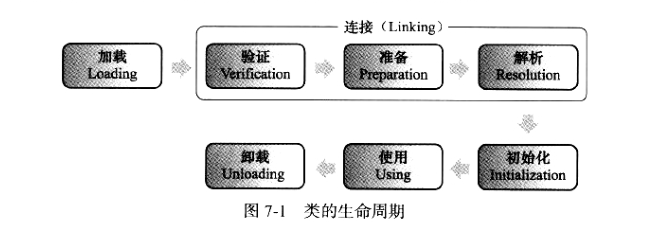

- [第7章-虚拟机类加载机制](#sec-1)
  - [类加载的时机](#sec-1-1)
  - [类加载的过程](#sec-1-2)
    - [加载](#sec-1-2-1)
    - [验证](#sec-1-2-2)
    - [准备](#sec-1-2-3)
    - [解析](#sec-1-2-4)
    - [初始化](#sec-1-2-5)
  - [类加载器](#sec-1-3)
    - [类与类加载器](#sec-1-3-1)
    - [双亲委派模型](#sec-1-3-2)

# 第7章-虚拟机类加载机制<a id="sec-1"></a>

## 类加载的时机<a id="sec-1-1"></a>

类从被加载到虚拟机内存中开始, 到卸载出内存为止, 它的整个生命周期包括

-   加载(Loading)
-   验证(Verification)
-   准备(Preparation)
-   解析(Resolution)
-   初始化(Initialization)
-   使用(Using)
-   卸载(Unloading)

其中验证, 准备, 解析3个部分统称为连接. 

加载, 验证, 准备, 初始化和卸载这5个阶段的顺序是固定的. 解析不一定, 这是为了支持Java语言的运行时绑定(动态绑定).

对于初始化阶段, 虚拟机规范严格规定了有且只有5种情况必须对类进行初始化(这5个场景的行为称为对一个类进行主动引用, 其余所有引用类的方式被称为被动引用).

-   遇到 `new` , `getstatic` , `putstatic` 或 `invokestatic` 这4个字节码指令时, 如果没有进行过初始化, 则需要先触发其初始化.
-   使用 `java.lang.reflect` 包的方法对类进行反射调用的时候, 如果类没有进行过初始化, 则需要先触发其初始化.
-   当初始化一个类的时候, 如果发现其父类还没有进行过初始化, 则需要先触发其父类的初始化.
-   当虚拟机启动时, 用户需要指定一个执行的主类(包括main()方法的那个类), 虚拟机会先初始化这个主类.
-   当使用JDK1.7的动态语言支持时, 如果一个 `java.lang.invoke.MethodHandle` 实例最后的解析结果 `REF_getStatic` , `REF_putStatic` , `Ref_invokeStatic` 的方法句柄, 并且这个方法句柄所对应的类没有进行过初始化, 则需要先触发其初始化.

## 类加载的过程<a id="sec-1-2"></a>

### 加载<a id="sec-1-2-1"></a>

在加载阶段, 虚拟机需要完成以下3件事情

-   通过一个类的全限定名来获取此类的二进制流
-   将这个字节所代表的静态存储结构转换为方法区的运行时数据结构
-   在内存中生成一个代表这个类的 `java.lang.Class` 对象, 作为方法区这个类的各种数据的访问入口

### 验证<a id="sec-1-2-2"></a>

该阶段验证Class文件的字节流中包含的信息符合当前虚拟机的要求.

-   文件格式验证
-   元数据验证
-   字节码验证
-   符号引用验证

### 准备<a id="sec-1-2-3"></a>

准备阶段是正式位类变量分配内存并设置变量初始值的阶段, 这些变量所使用的内存都将在方法区中分配.

这里进行内存分配的仅包括变量(被static修饰的变量), 不包括实例变量, 实例变量将会在对象实例化适随着对象一起分配在Java堆中.

### 解析<a id="sec-1-2-4"></a>

解析阶段是虚拟机将常量池内的符号引用替换为直接引用的过程.

符号引用: 符号引用以一组符号来描述所引用目标, 符号可以是任意形式的字面量, 只要使用时能无歧义地定位到目标即可.

直接引用: 直接引用可以是直接指向目标的指针, 相对偏移量, 或者是一个能间接定位到目标的句柄.

解析动作主要针对类或接口, 字段, 类方法, 接口方法, 方法类型, 方法句柄和调用点限定符7类符号引用进行

### 初始化<a id="sec-1-2-5"></a>

在初始化阶段, 则根据程序员通过程序制定的主管计划去初始化类变量和其他资源.

`<clinit>()` 方法是由编译器自动收集类中的所有变量的赋值动作和静态语句块 `static{}` 块中的语句合并产生的, 编译器收集的顺序是由语句在源文件中出现的顺序决定的.

`<clinit>()` 方法与类的构造函数不同, 它不需要显式地调用父类构造器, 虚拟机会保证子类的 `<clinit>` 方法执行前, 父类的先执行.

`<clinit>()` 方法对于类或接口来说并不是必须的.

执行接口的 `<clinit>()` 方法不需要先执行父接口的 `<clinit>()` 方法, 只有当父接口中定义的变量使用时, 父接口才会初始化.

虚拟机会保证一个类的 `<clinit>()` 方法在多线程环境中被正确的加锁, 同步, 如果多个线程同时初始化一个类, 那么只有一个线程去执行这个类的 `<clinit>()` 方法, 其他线程都需要阻塞等待, 直到所有活动线程执行 `<clinit>()` 方法完毕.

## 类加载器<a id="sec-1-3"></a>

类加载器的作用: 通过一个类的全限定名来获取此类的二进制流.

### 类与类加载器<a id="sec-1-3-1"></a>

对于任意一个类, 都需要由加载它的类和这个类本身一同确立其在Java虚拟机中的唯一性, 每个类加载器, 都有一个独立的名称空间.

比较两个类是否"相等", 只有在这两个类是由同一个类加载器加载的前提下才有意义.

```java
package chapter7;

import java.io.IOException;
import java.io.InputStream;

/**
 * @program: UnderstandingJVM
 * @author: devinkin
 * @create: 2019-11-04 14:40
 * @description: 类加载器与instanceof关键字演示
 **/
public class ClassLoaderTest {
    public static void main(String[] args) throws ClassNotFoundException, IllegalAccessException, InstantiationException {
        ClassLoader myLoader = new ClassLoader() {
            @Override
            public Class<?> loadClass(String name) throws ClassNotFoundException {
                try {
                    String fileName = name.substring(name.lastIndexOf(".") + 1) + ".class";
                    InputStream is = getClass().getResourceAsStream(fileName);
                    if (is == null) {
                        return super.loadClass(name);
                    }
                    byte[] b = new byte[is.available()];
                    is.read(b);
                    return defineClass(name, b, 0, b.length);
                } catch (IOException e) {
                    throw new ClassNotFoundException(name);
                }
            }
        };

        Object obj = myLoader.loadClass("chapter7.ClassLoaderTest").newInstance();
        System.out.println(obj.getClass());
        System.out.println(obj instanceof chapter7.ClassLoaderTest);
    }
}
```

### 双亲委派模型<a id="sec-1-3-2"></a>

从Java虚拟机的角度, 只存在两种不同的类加载器

-   启动类加载器(Bootstrap ClassLoader), 这个类加载器使用C++语言实现, 是虚拟机自身的一部分.
-   所有其他的类加载器, 这些类加载器都是Java语言实现的, 独立 于虚拟机外部, 并且全都继承自抽象类 `java.lang.ClassLoader`

从开发角度, 绝大部分Java程序都会使用到以下3种系统提供的类加载器

-   启动加载器(Bootstrap ClassLoader), 存放在 `<JAVA_HOME>\lib` 目录中, 或者被 `-Xbootclasspath` 参数所指定的路径中, 并且是虚拟机识别的类库加载到虚拟机内存中.
-   扩展类加载器(Extension ClassLoader), 这个加载器由 `sun.misc.Launcher$ExtClassLoader` 实现, 负责加载 `<JAVA_HOME>\lib\ext` 目录中,或者被 `java.ext.dirs` 系统变量所指定的路径中的所有类库, 开发者可以直接使用扩展类加载器.
-   应用程序类加载器(Application ClassLoader), 这个加载器由 `sun.misc.Launcher$ApplicationLoader` 实现. 这个类加载器是 `ClassLoader` 中的 `getSystemClassLoader()` 方法的返回值, 一般称为系统类加载器. 它负责加载用户类路径上所指定的类库, 开发者可以直接使用这个类加载器.

类加载器双亲委派模型, 自己先不会尝试加载这个类, 把请求委派给父亲加载器去加载类. 
